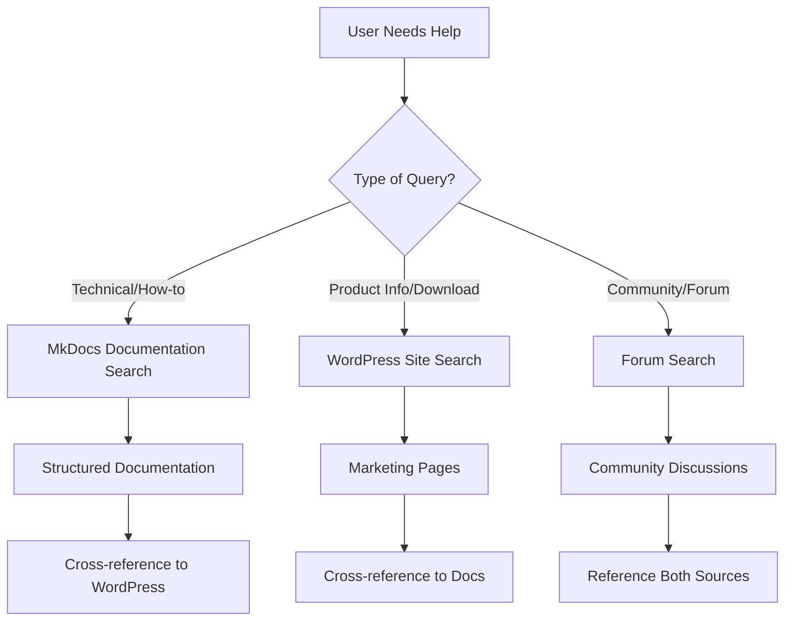

# 📝 Content Migration & Documentation Framework

!!! info "Content Migration Guide"
    **Framework for importing** content from quantumbitsolutions.com/help/ into structured documentation.  
    **Templates and guidelines** for consistent, searchable content.

[TOC]

## 🎯 Migration Strategy

### 1. Content Audit & Mapping

Based on your website structure, here's the recommended migration approach:

#### From quantumbitsolutions.com/help/
- **Product Manuals** → `docs/products/[product]/` 
- **Technical Articles** → `docs/technical/`
- **Support Content** → `docs/support/`
- **Video Guides** → Link to existing + embed descriptions

#### Content Priority (High → Low)
1. **Modbus Monitor XPF Manual** → Most comprehensive guide
2. **Error Codes & Troubleshooting** → High search volume
3. **Hardware Compatibility** → Common questions  
4. **Android Guides** → Mobile user base
5. **Mapper Pro Documentation** → Specialized tool
6. **Integration Examples** → Developer resources

### 2. WordPress to Markdown Workflow

#### Automated Approach (Recommended)
```yaml
# GitHub Action already configured in .github/workflows/deploy.yml
- Fetches WordPress content via REST API
- Converts HTML to Markdown with pandoc  
- Preserves images and formatting
- Commits to repository automatically
```

#### Manual Approach (For Complex Content)
1. **Copy content** from WordPress editor
2. **Paste into VS Code** markdown file
3. **Clean up formatting** using find/replace
4. **Add front matter** and navigation structure
5. **Test locally** with `mkdocs serve`

## 📋 Content Templates

### Product Guide Template

```markdown
---
title: Product Name - User Guide
description: Complete guide for [Product Name] with setup, configuration, and troubleshooting.
keywords: modbus, monitoring, [product-specific-terms]
---

# Product Name - User Guide

!!! info "Product Information"
    **Version**: [Current Version] • **Last Updated**: [Date]  
    **Platform**: [Windows/Android/Cross-platform]

[TOC]

## 🚀 Quick Start

!!! tip "New Users Start Here"
    Follow this 5-minute setup guide to get started immediately.

### System Requirements
- [List requirements]

### Installation
[Step-by-step installation]

### First Connection
[Basic setup example]

## 📖 Complete Guide

### [Major Feature 1]
[Detailed explanation]

### [Major Feature 2] 
[Detailed explanation]

## 🔧 Advanced Configuration

### [Advanced Topic 1]
[Complex procedures]

## ❓ Troubleshooting

### Common Issues
[Problem/solution pairs]

## 📞 Getting Help
Need assistance? Visit our [support page](../../support/index.md) or [contact us](https://quantumbitsolutions.com/contact-us/).
```

### Technical Article Template

```markdown
---
title: Technical Topic Name
description: Technical explanation of [topic] for Modbus systems.
keywords: modbus, protocol, technical, [topic-keywords]
---

# Technical Topic Name

!!! abstract "Overview"
    Brief description of what this article covers and who it's for.

[TOC]

## 📋 Background

[Context and prerequisites]

## 🔧 Implementation

### Method 1: [Approach Name]
[Step-by-step instructions]

### Method 2: [Alternative Approach]
[Alternative instructions]

## 💡 Examples

### Example 1: [Practical Scenario]
```code
[Code or configuration example]
```

## ⚠️ Common Pitfalls

[Things to avoid and troubleshooting]

## 📚 Related Resources
- [6-Digit Addressing Guide](6-digit-addressing.md)
- [Import/Export Guide](import-export.md)
```

## 🔍 Search Optimization Strategy

### MkDocs Search vs WordPress Search

#### ✅ **Recommendation: Use Both Strategically**

**MkDocs Search** (For Documentation)
- ✅ **Fast & Accurate** - Indexes all content for instant results
- ✅ **Contextual Highlighting** - Shows search terms in context
- ✅ **Keyboard Navigation** - Press `/` to search from anywhere
- ✅ **Offline Capable** - Works without internet connection
- ✅ **Technical Content** - Perfect for code, procedures, references

**WordPress Search** (For Marketing & Support)  
- ✅ **Dynamic Content** - Latest blog posts, announcements, forums
- ✅ **User Accounts** - Personalized results and history
- ✅ **E-commerce** - Product pages, downloads, purchases
- ✅ **SEO Integration** - Google indexing and external search

#### Optimal Implementation



### Enhanced MkDocs Search Configuration

Already implemented in your `mkdocs.yml`:

```yaml
plugins:
  - search:
      separator: '[\s\u200b\-_,:!=\[\]()"`/]+|\.(?!\d)|&[lg]t;|(?!\b)(?=[A-Z][a-z])'
      lang: 
        - en
      min_search_length: 2
```

**Benefits:**
- **Smart Tokenization** - Better word boundary detection
- **Minimum Length** - Reduces noise from short searches  
- **Language Support** - English-optimized searching
- **Special Character Handling** - Improved technical content search

## 📊 Content Organization Best Practices

### 1. Consistent Navigation Hierarchy

```
📁 Products (User-focused)
  └── 📁 xpf/ (Product-specific)
      ├── user-guide.md (Complete reference)
      ├── quick-start.md (Getting started)
      └── advanced-features.md (Power users)

📁 Technical (Implementation-focused)  
  └── 📁 protocol/ (Topic-based)
      ├── addressing.md (Reference)
      ├── error-codes.md (Troubleshooting)
      └── server-setup.md (Configuration)

📁 Support (Problem-solving)
  └── 📁 troubleshooting/ (Issue-based)
      ├── faq.md (Quick answers)
      ├── videos.md (Visual learning)
      └── contact.md (Human help)
```

### 2. Cross-Linking Strategy

**Internal Links** (Within Documentation)
```markdown
For connection issues, see [Error Codes](error-codes.md#connection-errors).
```

**External Links** (To Documentation Site)
```markdown
Download the latest version from our [downloads and purchase page](https://docs.quantumbitsolutions.com/downloads-purchase/).
```

**Bidirectional References**
- **WordPress pages** link to detailed documentation
- **Documentation** links to downloads and community

### 3. Search-Friendly Content

#### Use Consistent Keywords
```markdown
# Primary: "modbus monitor"
# Secondary: "tcp", "rtu", "ascii", "plc", "scada"
# Long-tail: "modbus connection timeout error"
```

#### Structure for Scanning  
```markdown
## Quick Answer (for search snippets)
Brief 1-2 sentence answer to the question.

## Detailed Explanation
Complete information with examples and context.

## Related Topics
- [Link 1](related1.md)
- [Link 2](related2.md)
```

## 🚀 Implementation Checklist

### Phase 1: Core Content Migration
- [ ] **XPF User Guide** - Primary product documentation
- [ ] **Error Codes Reference** - High-traffic troubleshooting  
- [ ] **Hardware Compatibility** - Essential technical reference
- [ ] **FAQ Content** - Common questions and answers

### Phase 2: Technical Resources
- [ ] **Protocol Documentation** - Modbus implementation details
- [ ] **Integration Guides** - API and development resources
- [ ] **Best Practices** - Configuration and optimization

### Phase 3: Enhanced Features  
- [ ] **Video Integration** - Embed or link tutorial content
- [ ] **Interactive Examples** - Code samples with explanations
- [ ] **Download Integration** - Links to software and resources

### Phase 4: Community Integration
- [ ] **Forum Integration** - Connect with WordPress discussions
- [ ] **User Feedback** - Collect improvement suggestions
- [ ] **Analytics** - Track usage and optimize content

---

!!! success "Ready to Migrate!"
    Your documentation framework is now optimized for:
    
    ✅ **Easy Content Migration** - From WordPress to structured docs  
    ✅ **Enhanced Search** - Both local and site-wide discovery  
    ✅ **Professional Navigation** - Collapsible, hierarchical organization  
    ✅ **User Experience** - Fast, accessible, mobile-friendly  
    
    **Next**: Start migrating your highest-priority content using the templates above!