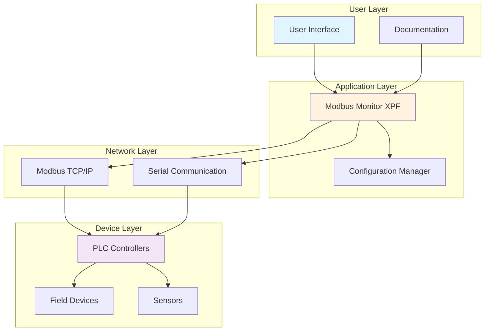
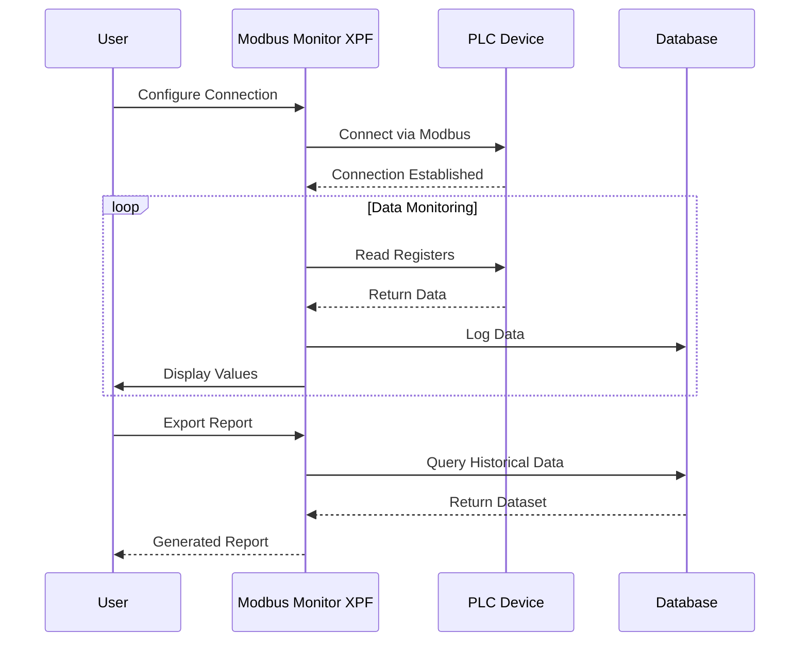
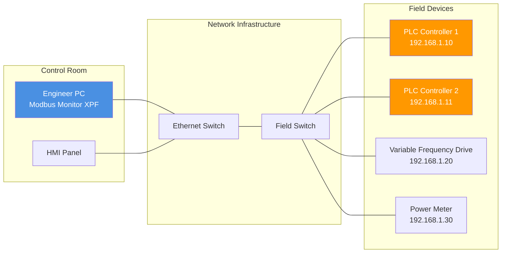

# 📚 Complete Documentation Features Demo

!!! info "Feature Demo Page"
    This page demonstrates all available documentation features for complex technical documentation.

[TOC]

## 🎨 Visual Elements

### Admonitions (Info Boxes)

!!! note "Information"
    General information and notes

!!! tip "Pro Tip"
    Helpful tips and best practices

!!! warning "Important"
    Warnings and cautions

!!! danger "Critical"
    Critical warnings

!!! example "Example"
    Code examples and demonstrations

!!! question "FAQ"
    Frequently asked questions

??? abstract "Collapsible Section"
    This content is collapsible - click to expand/collapse
    
    - Hidden content here
    - Multiple lines supported
    - Great for advanced topics

## 📋 Tabbed Content

=== "Windows Setup"

    **Installation on Windows:**
    
    1. Download installer
    2. Run as Administrator
    3. Follow wizard steps
    
    ```batch
    # Windows batch command
    installer.exe /silent /dir="C:\Program Files\App"
    ```

=== "Linux Setup"

    **Installation on Linux:**
    
    1. Add repository
    2. Update package list
    3. Install via package manager
    
    ```bash
    # Linux commands
    sudo apt update
    sudo apt install application
    ```

=== "macOS Setup"

    **Installation on macOS:**
    
    1. Download .dmg file
    2. Mount disk image
    3. Drag to Applications
    
    ```bash
    # macOS commands
    brew install application
    ```

## 📊 Diagrams and Charts

### System Architecture



### Process Flow



### Network Topology



## 📝 Code Examples

### Syntax Highlighting

```python title="modbus_client.py" linenums="1"
import pymodbus
from pymodbus.client.sync import ModbusTcpClient

# Connect to Modbus device
client = ModbusTcpClient('192.168.1.10', port=502)

# Read holding registers
def read_sensors():
    """Read temperature and pressure sensors."""
    try:
        # Read registers 40001-40010 (1)
        result = client.read_holding_registers(0, 10, unit=1)
        
        if result.isError():
            print(f"Error: {result}")
            return None
            
        # Extract values
        temperature = result.registers[0] / 10.0  # (2)
        pressure = result.registers[1] / 100.0
        
        return {
            'temperature': temperature,
            'pressure': pressure,
            'timestamp': datetime.now()
        }
        
    except Exception as e:
        print(f"Connection error: {e}")
        return None

# Main monitoring loop
if __name__ == "__main__":
    while True:
        data = read_sensors()
        if data:
            print(f"Temperature: {data['temperature']}°C")
            print(f"Pressure: {data['pressure']} bar")
        time.sleep(1)
```

1. Register addresses are 0-based in pymodbus
2. Apply scaling factor for sensor readings

### Configuration Examples

```yaml title="config.yml"
# Modbus Monitor XPF Configuration
connection:
  type: tcp
  host: 192.168.1.10
  port: 502
  timeout: 3000
  
registers:
  - address: 40001
    name: "Temperature Sensor"
    type: float
    scaling: 0.1
    unit: "°C"
    
  - address: 40002  
    name: "Pressure Sensor"
    type: float
    scaling: 0.01
    unit: "bar"

logging:
  enabled: true
  interval: 1000  # milliseconds
  format: csv
  destination: "data/logs/"
```

## 📊 Tables and Data

### Register Mapping

| Address | Name | Type | Range | Unit | Description |
|---------|------|------|-------|------|-------------|
| 40001 | TEMP_01 | Float | 0-1000 | °C | Reactor temperature |
| 40002 | PRESS_01 | Float | 0-100 | bar | System pressure |
| 40003 | FLOW_01 | Integer | 0-500 | L/min | Flow rate |
| 40004 | LEVEL_01 | Float | 0-100 | % | Tank level |

### Communication Parameters

| Parameter | Standard Value | Range | Notes |
|-----------|----------------|-------|--------|
| Baud Rate | 19200 | 1200-115200 | For serial communication |
| Data Bits | 8 | 7-8 | Standard is 8 |
| Stop Bits | 1 | 1-2 | Typically 1 |
| Parity | None | None/Even/Odd | Most devices use None |
| Timeout | 3000ms | 100-10000ms | Adjust for network latency |

## ⌨️ Keyboard Shortcuts

Use these keyboard shortcuts for efficient operation:

- ++ctrl+n++ : New connection
- ++ctrl+o++ : Open configuration
- ++ctrl+s++ : Save current settings
- ++f5++ : Refresh data
- ++ctrl+shift+e++ : Export data
- ++alt+f4++ : Exit application

## 🧮 Mathematical Expressions

For complex calculations, you can use mathematical notation:

The Modbus register scaling formula is:

$$
\text{Scaled Value} = \frac{\text{Raw Value} \times \text{Scale Factor}}{10^{\text{Decimal Places}}}
$$

For temperature conversion:
$$
\text{Temperature}_{°F} = \text{Temperature}_{°C} \times 1.8 + 32
$$

Inline math: The power calculation $P = V \times I \times \cos(\phi)$ where $\phi$ is the phase angle.

## 📝 Task Lists and Checklists

### Pre-Installation Checklist

- [x] Verify system requirements
- [x] Download latest version
- [x] Backup existing configuration
- [ ] Stop existing Modbus services
- [ ] Install new version
- [ ] Test connections
- [ ] Restore configuration
- [ ] Validate functionality

### Troubleshooting Steps

1. **Connection Issues**
   - [ ] Check network connectivity
   - [ ] Verify IP address and port
   - [ ] Test with ping command
   - [ ] Check firewall settings

2. **Data Quality Issues**  
   - [ ] Validate register addresses
   - [ ] Check data scaling factors
   - [ ] Verify device configuration
   - [ ] Test with known good values

## 🔗 Cross-References and Links

- See [Installation Guide](../products/xpf/quick-start.md) for setup instructions
- Refer to [Configuration](../products/xpf/user-guide.md#7-monitor-points-configuration) section
- Check [Troubleshooting](#troubleshooting-steps) above
- External link: [Modbus Specification](https://modbus.org/docs/Modbus_Application_Protocol_V1_1b3.pdf)

## 📸 Screenshots and Images

!!! example "Adding Screenshots"
    To add screenshots to your documentation:
    
    1. Take screenshot of the application
    2. Save as PNG in `docs/images/` folder  
    3. Reference with: `{: .screenshot}`
    4. The `.screenshot` class applies custom styling

**Placeholder for screenshots:**

{: .screenshot}

*Figure 1: Main application interface showing connection status and data monitoring*

## 📚 Content Inclusion

You can include content from other files:

```markdown
<!-- Include shared configuration -->
--8<-- "includes/common-config.md"

<!-- Include code snippets -->
--8<-- "code-examples/basic-connection.py"
```

## 🎯 Summary

This documentation system now supports:

- ✅ **Rich formatting**: Admonitions, tabs, collapsible sections
- ✅ **Interactive diagrams**: Mermaid flowcharts, sequences, network diagrams  
- ✅ **Advanced code blocks**: Syntax highlighting, line numbers, annotations
- ✅ **Mathematical expressions**: LaTeX-style math rendering
- ✅ **Professional tables**: Sortable, styled data tables
- ✅ **Cross-references**: Internal and external linking
- ✅ **Task management**: Checklists and progress tracking
- ✅ **Media support**: Screenshots, images with custom styling
- ✅ **Keyboard shortcuts**: Formatted key combinations
- ✅ **Content inclusion**: Reusable snippets and code files

Your documentation system is now enterprise-ready for complex technical documentation!