Title: Modbus Monitor XPF HMI Guide | Build Modbus Dashboards with Widgets
Description: Build live Modbus HMI dashboards in Modbus Monitor XPF using widgets, trends, controls, reusable layouts, and state-aware visualization.
Image: /assets/screenshots/xpf/xpf-hmi-demo.webp

# Modbus Monitor XPF HMI Guide

Use this as the single HMI guide page for XPF. It covers overview, dashboard management workflow, and widget reference in one place.

{ .screenshot-shadow loading="lazy" }
*This is a example layout used in real-world commissioning and monitoring scenarios.*

## Build Industrial Dashboards Without Custom UI

The HMI feature in **Modbus Monitor XPF** lets you build **live industrial dashboards in minutes** using widgets connected directly to Modbus data.

Instead of building custom UI screens from scratch, you can assemble a working operator dashboard using ready-to-use components, real-time data binding, and reusable layouts.

This makes XPF ideal for **commissioning, troubleshooting, and production monitoring** where speed and clarity matter.

Use the HMI feature when you need:

- a live dashboard for commissioning
- a simple operator screen
- a reusable monitoring layout
- a quick way to test values, states, and controls together
- a fast alternative to building a full SCADA or custom HMI system

<!-- Screenshot placeholder: xpf-hmi-guide-01-overview.png -->
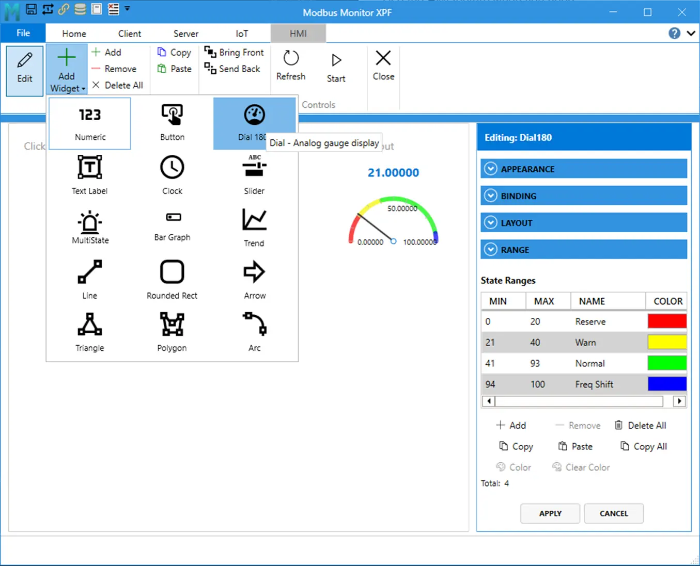{.screenshot-shadow loading="lazy" }
 
## Why Use XPF for HMI

Traditional HMI or SCADA dashboards often require significant setup, custom development, or specialized tools.

With Modbus Monitor XPF, you can:

- Build dashboards in **hours instead of weeks**
- Reuse layouts across multiple systems using `.hmi` files
- Combine monitoring, control, and visualization in one place
- Quickly validate system behavior during commissioning
- Reduce engineering effort for repeated projects

This makes XPF especially useful for engineers who need **fast, reliable visibility without heavy setup overhead**.

## What You Can Build

Common uses include:

- real-time monitoring screens
- equipment status panels
- operator control panels
- setpoint adjustment screens
- trend views for changing values
- dashboards with time and event visibility

## HMI Widget System Overview

### Core Gauges and Status Widgets

Use these widgets to display live values and state changes in a clean, operator-friendly way:

- `Numeric`
- `Dial180`
- `Bar Graph`
- `MultiState Indicator`

### Interactive Controls

Use these widgets when operators need to safely interact with live systems:

- `Button`
- `Slider`
- `Text Label` for labels, messages, or optional text write scenarios

### Advanced and Utility Widgets

Use these widgets to enhance dashboards with trends, time awareness, and visual structure:

- `Trend`
- `Clock`
- `Line`
- `Rounded Rectangle`
- `Arrow`
- `Triangle`
- `Polygon`
- `Arc`

Jump to [Widget Reference](#widget-reference).

<!-- Screenshot placeholder: xpf-hmi-guide-02-widget-categories.png -->
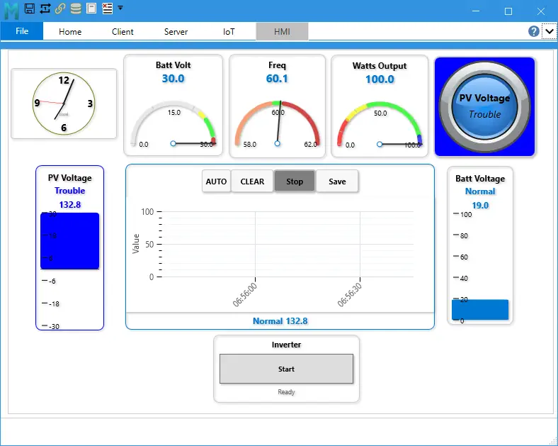{ .screenshot-shadow loading="lazy" }
<!-- Suggested capture: one dashboard showing numeric, state, trend, button, and shape widgets together -->

## Build Your First Dashboard (2-5 Minutes)
Most dashboards can be created in minutes using this workflow:

### 1. Open the HMI area

Open the **HMI** tab in XPF.

### 2. Add widgets

Choose the widget types needed for your dashboard.

### 3. Bind data

Connect each widget to the correct Modbus monitor point.

### 4. Configure properties

Set ranges, labels, colors, formatting, limits, and behavior.

### 5. Save the dashboard

Save the dashboard so it can be reopened, copied, or shared.

### 6. Run and monitor

Use the live dashboard for monitoring, troubleshooting, and operator interaction.

Jump to [HMI Dashboard Management](#hmi-dashboard-management).

## Reusable Dashboard Workflow { #save-and-load-behavior }

Supported file formats:

- `.hmi` for dashboard packages with image assets

When loading dashboards:
- You can drag and drop a `.hmi` file directly onto the HMI background or canvas.
- If a `.hmi` file and a `.csv` file are in the same folder and share the same base name, XPF automatically finds and loads both.
- Example: `line-a.hmi` and `line-a.csv`.

This makes it easy to reuse dashboards across projects, share setups between teams, and standardize layouts.

This allows fast replication of dashboards across machines and projects.

<!-- Screenshot placeholder: xpf-hmi-guide-03-save-load.png -->
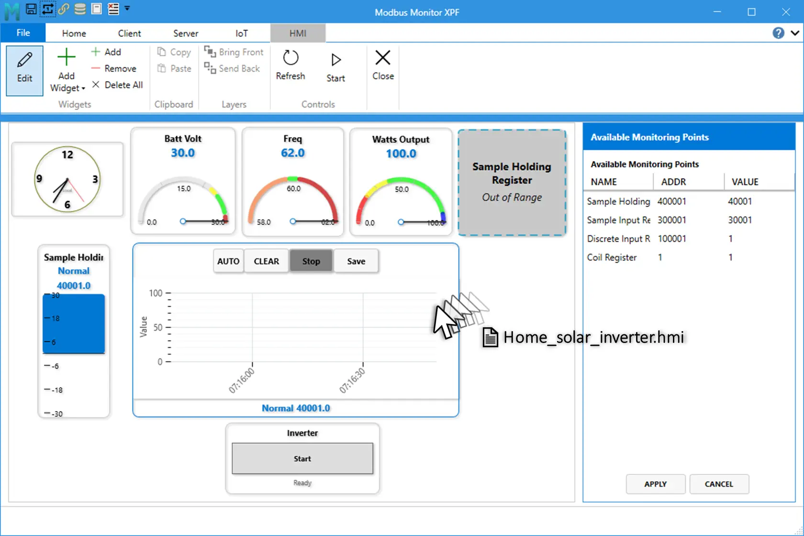{ .screenshot-shadow loading="lazy" }
<!-- Suggested capture: dragging a .hmi file onto the canvas and loaded dashboard result -->

## Recommended First Dashboard

A simple first dashboard usually includes:

- one `Numeric` widget
- one `Dial180` or `Bar Graph`
- one `MultiState Indicator`
- one `Trend`
- one `Button` or `Slider`
- one `Clock`

This gives a balanced screen with value display, state visibility, trend history, and operator control.

## Licensing Notes

This tiered approach lets you start simple and expand into advanced control and trending as your system grows.

## HMI Dashboard Management { #hmi-dashboard-management }

This reference helps you choose the right widget quickly and configure it correctly for reliable operation.

### Ribbon Controls

| Group | Control | What It Does |
|---|---|---|
| Widgets | Edit | Turns design mode on or off |
| Widgets | Add Widget | Opens the full widget gallery |
| Widgets | Add | Adds a default widget |
| Widgets | Remove | Deletes selected widget |
| Widgets | Delete All | Clears all widgets from canvas |
| Clipboard | Copy | Copies selected widget (`Ctrl+C`) |
| Clipboard | Paste | Pastes a duplicate (`Ctrl+V`) |
| Controls | Refresh | Reloads current values |
| Controls | Start/Stop | Starts or stops monitoring engine |

### Add, Configure, and Validate Widgets

1. Turn **Edit** on.
2. Click **Add Widget** and pick a widget type.
3. Set **Monitoring Point**.
4. Configure range and display properties.
5. Add state ranges for widgets that support state logic.
6. Turn **Edit** off and validate runtime behavior.

### Copy and Paste

- Copy keeps widget properties, style, binding, and state ranges.
- Paste creates a new widget with a new ID and position offset.

### Save and Load

See [Save and Load Behavior](#save-and-load-behavior) above for file types and auto-pair behavior.

### Shape Tip: Ellipse from Rounded Rectangle

- Set `RadiusX = Width / 2`
- Set `RadiusY = Height / 2`

Example circle:

- `Width=120`, `Height=120`, `RadiusX=60`, `RadiusY=60`

## Widget Reference { #widget-reference }

Use this section for widget setup, key properties, and min/max ranges.

### Widget List

| # | Widget | Register Binding | Write Support | Free | Basic | Pro | Best Use |
|---|---|---|---|---|---|---|---|
| 1 | Numeric | Required | No | Yes | Yes | Yes | Clear process value display |
| 2 | Button | Required | Yes | No | No | Yes | One-click command/write |
| 3 | Dial180 | Required | No | No | Yes | Yes | Analog-style gauge view |
| 4 | Text Label | Optional | Optional | Yes | Yes | Yes | Titles, notes, text values |
| 5 | Clock | Not required | No | Yes | Yes | Yes | Time on dashboard |
| 6 | Slider | Required | Yes | No | No | Yes | Setpoint adjustment |
| 7 | MultiState Indicator | Required | No | No | Yes | Yes | State by value range |
| 8 | Bar Graph | Required | No | No | Yes | Yes | Fill-level visualization |
| 9 | Trend | Required | No | No | No | Yes | Real-time history trend |
| 10 | Line | Optional | No | No | Yes | Yes | Direction/flow line |
| 11 | Rounded Rectangle | Optional | No | No | Yes | Yes | Status tile / shape zone |
| 12 | Arrow | Optional | No | No | Yes | Yes | Direction indicator |
| 13 | Triangle | Optional | No | No | Yes | Yes | Compact directional marker |
| 14 | Polygon | Optional | No | No | Yes | Yes | Multi-sided status marker |
| 15 | Arc | Optional | No | No | Yes | Yes | Arc/sector indicator |

License note:

- `Free`: core view-only widgets (`Numeric`, `Text Label`, `Clock`)
- `Basic`: adds advanced display widgets and shape widgets
- `Pro`: adds control widgets (`Button`, `Slider`) and `Trend`

### Quick Setup Rules

1. Bind **Monitoring Point** first.
2. Set **Minimum/Maximum** when the widget has a range.
3. Set labels and formatting.
4. Add state ranges where supported.
5. Turn **Edit** off and validate runtime behavior.

### State Ranges (Property Window) { #state-ranges-property-window }

<!-- Suggested capture: Property panel showing State Ranges table with Add/Remove/Delete All and Color actions -->
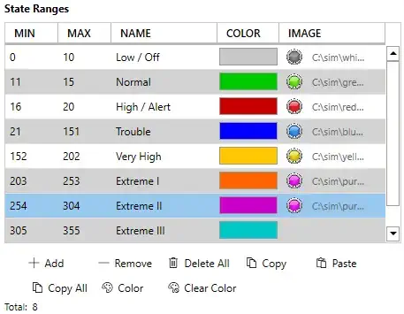{ .screenshot-shadow loading="lazy" }

Use **State Ranges** in the property panel for widgets that converts values into the colors, names, and images. For example the `MultiState Indicator` takes the numberical value and changes the widget background to color `red`, name `running`, image `red LED`).

State ranges define behavior by value window:

- `Min <= CurrentValue <= Max` (inclusive bounds)
- First matching range is applied
- If no range matches, widget uses its default state style

#### Table Columns

| Column | Purpose | Example |
|---|---|---|
| `MIN` | Lower inclusive bound | `0` |
| `MAX` | Upper inclusive bound | `20` |
| `NAME` | State label shown by widget | `Low / Off` |
| `COLOR` | State color preview and picker target | Gray |

#### Property Window Actions

| Action | What It Does | Notes |
|---|---|---|
| `Add` | Adds a new state row | Starts with default values you can edit |
| `Remove` | Removes selected row | Requires row selection |
| `Delete All` | Clears all ranges | Widget falls back to default state styling |
| `Copy` | Copies selected range | Useful for quick duplication |
| `Paste` | Pastes copied range(s) | Preserves values/colors/names |
| `Copy All` | Copies entire range set | Helpful between similar widgets |
| `Color` | Opens color picker for selected range | Use to set final visual state color |
| `Clear Color` | Clears selected color override | Reverts to default handling |

#### Matching and Priority Rules

- Evaluation is continuous as values update.
- Overlapping ranges are allowed, but top-first match wins.
- Gaps are allowed; gap values use default state style.
- Recommended practice: keep ranges contiguous and non-overlapping for predictable behavior.

Example ordered ranges:

- `0-20` -> `Low / Off`
- `21-60` -> `Normal`
- `61-100` -> `High / Alert`

#### Visual Highlighting Behavior

Range-capable widgets can visually emphasize the active state range at runtime.
Typical pattern:

- Active range: stronger emphasis (for example thicker stroke/full opacity)
- Inactive ranges: reduced emphasis

This gives immediate feedback when the live value moves across thresholds.

#### Save and Load Behavior for State Ranges

State ranges are persisted in widget JSON during dashboard save and restored during load.
Saved fields include:

- `MinValue`
- `MaxValue`
- `StateName`
- `StateColor`
- optional `ImagePath` where supported

If a widget supports image-backed states, image paths are included in HMI package workflows via widget image collection.

### Key Widget Property Summary

| Widget | Core Properties |
|---|---|
| Numeric | `Monitoring Point`, `DisplayFormat`, `MinValue`, `MaxValue` |
| Button | `Monitoring Point`, `WriteValue`, `MinValue`, `MaxValue` |
| Dial180 | `Monitoring Point`, `Minimum`, `Maximum`, `StartAngle`, `SweepAngle` |
| Text Label | `DisplayText`, optional binding |
| Clock | `TimeFormat`, `DisplayMode`, `ShowSeconds` |
| Slider | `Monitoring Point`, `MinValue`, `MaxValue`, `SliderStep` |
| MultiState Indicator | `Monitoring Point`, `StateRanges` |
| Bar Graph | `Minimum`, `Maximum`, `Orientation`, `BipolarCenter` |
| Trend | `Minimum`, `Maximum`, `SampleCount`, `RenderStyle` |
| Line | `LineThickness`, `Orientation`, `AngleDegrees` |
| Rounded Rectangle | `RadiusX`, `RadiusY`, `StrokeThickness`, `RotationDegrees` |
| Arrow | `HeadLengthPercent`, `ShaftThicknessPercent`, `RotationDegrees` |
| Triangle | `Orientation`, `StrokeThickness`, `RotationDegrees` |
| Polygon | `SideCount`, `StrokeThickness`, `RotationDegrees` |
| Arc | `StartAngle`, `SweepAngle`, `StrokeThickness`, `RotationDegrees` |

### Per-Widget Details

### Numeric
<!-- Suggested capture: Numeric widget showing value, label, and state color -->
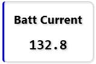{loading="lazy" }

- Purpose: compact numeric value display bound to one monitoring point.
- Binding: required.
- Main properties: `WidgetLabel`, `DisplayFormat`, `FontSize`, `TextColor`, `ShowLabel`, `MinValue`, `MaxValue`.
- Ranges and limits: default range is `0` to unbounded max; state ranges can be used for color changes; display formatting follows the configured decimal-place settings.
- Notes: use this when operators need the exact current value, not a write control.

### Button
<!-- Suggested capture: Button widget with write value and click action in runtime -->
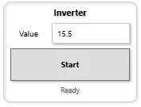{loading="lazy" }

- Purpose: one-click write command to a bound register with preset value.
- Binding: required.
- Main properties: `WidgetLabel`, `ButtonLabel`, `WriteValue`, `ShowLabel`, `ShowValueTextBox`, `MinValue`, `MaxValue`.
- Ranges and limits: `WriteValue` defaults to `1.0`; optional `MinValue` and `MaxValue` clamp user input before write; status text clears automatically after the write completes.
- Notes: best for fixed commands such as start, stop, reset, or mode selection. This is a Pro-tier control widget.

### Dial
<!-- Suggested capture: Dial180 with needle, ticks, and configured min/max arc -->
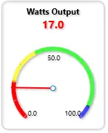{loading="lazy" } 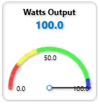{loading="lazy" }

- Purpose: analog-style needle gauge with configurable arc.
- Binding: required.
- Main properties: `Monitoring Point`, `Show Label`, `Display Name`, `Show Scale`, `Show Border`, `Value Format`, `Start Angle (deg)`, `Sweep Angle (deg)`, `Gauge Minimum`, `Gauge Maximum`, `Operating Minimum`, `Operating Maximum`, `Major Tick Step`, `Minor Tick Step`, `Width`, `Height`.
- Ranges and limits: default visual range is `Gauge Minimum = 0` and `Gauge Maximum = 100`; default dial geometry is `Start Angle = 180` and `Sweep Angle = -180`; default operating range is `0-100`; tick defaults are `20` major and `10` minor; widget layout range in the property editor is `Width 100-800` and `Height 100-600`; gauge maximum is normalized so it cannot remain below minimum.
- Notes: use this when you want an analog gauge look with clear tick marks rather than a raw number. The current code exposes `Value Format` and `Show Scale`; the quick-reference mentions `RangeFormat` and `ShowNeedle`, but those are not separate user-editable properties in the current implementation.

##### Dial Drawing Rules

Use these geometry rules when drawing a dial:

- `Start Angle (deg)` places the minimum-value end of the dial.
- `Sweep Angle (deg)` controls how far the dial travels from minimum to maximum.
- Negative sweep values draw clockwise in the current implementation and are the standard choice for the built-in recipes.
- `0 = East`, `90 = North`, `180 = West`, `270` or `-90 = South`.
- `Major Tick Step = 0` hides major and minor tick generation in practice. `Minor Tick Step = 0` hides only the minor ticks.

##### Direction Cheat Sheet

| Direction | Start Angle | Meaning |
|---|---:|---|
| East | `0` | Minimum starts at the right side, around 3 o'clock |
| North | `90` | Minimum starts at the top, around 12 o'clock |
| West | `180` | Minimum starts at the left side, around 9 o'clock |
| South | `270` or `-90` | Minimum starts at the bottom, around 6 o'clock |

##### Dial Recipe Table

| Dial Style | Start Angle (deg) | Sweep Angle (deg) | Major Tick Step | Minor Tick Step | What It Draws |
|---|---:|---:|---:|---:|---|
| Classic 180 horizontal | `180` | `-180` | `20` | `10` | Standard semicircle from west to east across the top |
| Inverted 180 | `90` | `-180` | `10` | `5` | Semicircle flipped so the sweep runs across the lower half |
| Industrial 270 | `225` | `-270` | `25` | `5` | Three-quarter dial with mid-scale pointing down |
| Compact temperature arc | `200` | `-140` | `10` | `5` | Narrower partial arc for tight layouts |
| East-facing half dial | `0` | `-180` | `20` | `10` | Semicircle starting on the right side |
| North-facing half dial | `90` | `-180` | `20` | `10` | Semicircle starting at the top |
| West-facing half dial | `180` | `-180` | `20` | `10` | Semicircle starting on the left side |
| South-facing half dial | `270` | `-180` | `20` | `10` | Semicircle starting at the bottom |
| Near full circle | `225` | `-359` | `30` | `10` | Almost complete ring while avoiding a closed 360-degree overlap |
| Arbitrary custom dial | `45` | `-180` | `20` | `10` | Half dial starting around the 1:30 position |

##### Parameter Table

| Property | Purpose | Default | Validated Behavior in Code |
|---|---|---|---|
| `Start Angle (deg)` | Places the minimum end of the dial | `180` | Used directly by arc and tick converters; `0` right, `90` up, `180` left |
| `Sweep Angle (deg)` | Sets dial span and direction | `-180` | Used directly by arc and tick converters; negative values produce the standard clockwise sweep |
| `Gauge Minimum` | Visual scale minimum | `0` | If maximum is set lower than minimum, maximum is normalized up to minimum |
| `Gauge Maximum` | Visual scale maximum | `100` | Cannot remain below minimum |
| `Operating Minimum` | Lower operating band for display and state logic | `0` | Used for operating-range highlighting and display clamping |
| `Operating Maximum` | Upper operating band for display and state logic | `100` | Explicitly setting it enables display clamping behavior |
| `Major Tick Step` | Spacing between major ticks | `20` | Exposed in property editor; use `0` to suppress visible tick generation |
| `Minor Tick Step` | Spacing between minor ticks | `10` | Exposed in property editor; use `0` to hide minor ticks |
| `Value Format` | Number formatting for value and tick labels | blank | Blank falls back to the global decimal-place setting |
| `Show Scale` | Shows or hides tick marks and scale labels | `true` | Bound directly in the view |

##### Recommended Setup Order

1. Set `Monitoring Point`.
2. Set `Gauge Minimum` and `Gauge Maximum` for the full scale.
3. Set `Operating Minimum` and `Operating Maximum` if you want an operating band separate from the full gauge scale.
4. Pick `Start Angle (deg)` and `Sweep Angle (deg)` from the recipe table.
5. Adjust `Major Tick Step` and `Minor Tick Step` for coarse or dense ticks.
6. Set `Value Format` or leave it blank to use global decimal places.

#### Text Label
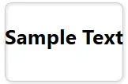{loading="lazy" }
<!-- Suggested capture: Text Label in static mode and bound text mode -->

- Purpose: static text or optional bound text value.
- Binding: optional. Use static mode for labels and notes, or enable Modbus mode for a bound text/value display.
- Main properties: `DisplayText`, `IsModbusEnabled`, `EnableWrite`, `WidgetLabel`, `FontSize`, `TextColor`, `ShowLabel`, `WriteValue`.
- Ranges and limits: `FontSize` is clamped to `8-72`; text write support is license-gated; if Modbus is disabled the widget shows `DisplayText`, otherwise it shows the bound value.
- Notes: use this for titles, instructions, annotations, and simple text-driven status. Write mode is an advanced Pro-tier scenario.

### Clock

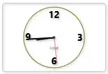{loading="lazy" } 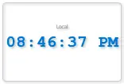{loading="lazy" }
<!-- Suggested capture: Clock widget showing digital and analog modes -->

- Purpose: live system clock widget with dual display modes (digital and analog); no register binding required.
- Binding: not required.
- Main properties: `Show Label`, `Show Border`, `Display Mode`, `Time Format`, `Show Seconds`, `Time Zone`, `Width`, `Height`.
- Ranges and limits: `Display Mode` supports `Digital` or `Analog`; `Time Format` supports `12h` or `24h`; `Time Zone` accepts `Local`, `UTC`, `UTC±offset` (e.g., `UTC+5.5`, `UTC-8`), or Windows timezone IDs; width and height range from `50` to `2000` pixels; if an invalid timezone is specified, the widget falls back to system local time.
- Notes: the widget updates from system time every 500 milliseconds to one second. Use it for timestamp visibility on operator panels, wallboard dashboards, or any screen requiring live time display.
- Add multiple clocks to build the world-clock with different time zones.

##### Clock Time Format Examples

| Time Format | 12h Example | 24h Example | Display When `ShowSeconds = false` |
|---|---|---|---|
| `12h` with seconds | `2:45:30 PM` | N/A | `2:45 PM` |
| `24h` with seconds | N/A | `14:45:30` | `14:45` |

##### Clock Time Zone Options

**Predefined Options:**

- **System Local:** `Local` (uses operating system timezone)
- **UTC:** `UTC` (Coordinated Universal Time)
- **UTC Offsets:** `UTC-12` through `UTC+12` in 1-hour increments (e.g., `UTC+5.5` for India Standard Time)
- **Windows TimeZone IDs:** `Eastern Standard Time`, `Central Standard Time`, `Mountain Standard Time`, `Pacific Standard Time`, `GMT Standard Time`, `Central European Standard Time`, `India Standard Time`, `Singapore Standard Time`, `AUS Eastern Standard Time`, `New Zealand Standard Time`, and others

**Fallback Behavior:**

When you specify a timezone:

1. The widget attempts to find it via Windows `System Time Zone By ID`
2. If not found, it parses as a UTC offset string (e.g., `UTC+5.5`)
3. If parsing fails, it falls back to system local time

##### Clock Parameter Table

| Property | Purpose | Default | Validated Behavior in Code |
|---|---|---|---|
| `Show Label` | Display widget label above or below clock | `true` | Toggled directly in property editor |
| `Show Border` | show 3D border/shadow around widget | `true` | Toggled directly in property editor |
| `Display Mode` | Clock style: digital numbers or analog hands | `Digital` | Dropdown: `Digital` or `Analog`; property change triggers re-render |
| `Time Format` | How to display time on digital mode | `24h` | Dropdown: `12h` (with AM/PM) or `24h` (24-hour); changing format triggers `UpdateTime()` which reformats the display string and recalculates analog hand rotations |
| `Show Seconds` | Include seconds in time display | `true` | Toggled directly in property editor; toggling triggers `UpdateTime()` to switch between HH:mm:ss ↔ HH:mm format |
| `Time Zone` | Which timezone to display | `Local` | Text/dropdown; accepts `Local`, `UTC`, `UTC±offset`, or Windows timezone names; invalid zones fall back to local time via robust validation chain |
| `Width` | Clock widget width in pixels | 150 | Numeric; clamped to `50–2000` pixel range |
| `Height` | Clock widget height in pixels | 100 | Numeric; clamped to `50–2000` pixel range; aspect ratio not enforced, so you can stretch or compress |

##### Recommended Clock Setup Order

1. Optionally set `Display Name` / widget label via `Show Label`.
2. Choose `Display Mode`: `Digital` for numeric time or `Analog` for clock face.
3. Choose `Time Format`: `12h` with AM/PM or `24h` military time.
4. Optionally toggle `Show Seconds`.
5. Set `Time Zone` if you need a timezone other than system local.
6. Adjust `Width` and `Height` to fit your dashboard layout.

### Slider

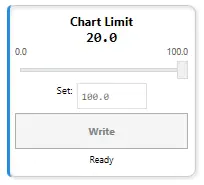{loading="lazy" }
<!-- Suggested capture: Slider widget adjusting setpoint with current value -->

- Purpose: setpoint adjustment by dragging, with optional live updates or manual write-button confirmation.
- Binding: required.
- Main properties: `Monitoring Point`, `Display Name`, `Show Label`, `Show Border`, `Font Size`, `Label Color`, `Minimum Value`, `Maximum Value`, `Tick Frequency`, `Default Write Value`, `Enable Live Updates`, `Show Write Button`, `Width`, `Height`.
- Ranges and limits: default range is `0` to `100`; `Tick Frequency` (slider step) must be `>0` and defaults to `1.0` (forced to `1` if set to `0` or negative); `Default Write Value` is automatically snapped to the nearest tick and clamped to the range; all snapping and clamping re-applies when you change the range or step; widget layout range is `Width 120-400` and `Height 100-400`.
- Notes: use `Enable Live Updates = false` (default) for safe manual writes with a button click and status feedback; use `Enable Live Updates = true` only when continuous writes during drag are acceptable. This is a Pro-tier control widget.

##### Slider Write Modes

Two modes control when values are written to the Modbus register:

1. **Manual Write Mode (Default, `Enable Live Updates = false`)**
   - Slider drag updates the display value only; no register write occurs.
   - Click the **Write** button to send the value to the register.
   - Status displays `"✓ Wrote {value} to {register}"` and clears after 2 seconds.
   - Safe for slow-responding devices or when you want operator confirmation before each write.

2. **Live Update Mode (`Enable Live Updates = true`)**
   - Every slider drag position immediately writes to the register.
   - No Write button needed (even if `Show Write Button = true`, it has no effect).
   - Status shows `"✓ Live Update"` but does not auto-clear.
   - Useful for real-time trim, PID feedback, or quick response-required scenarios.

##### Slider Step and Snap Behavior

The slider snaps all values to the nearest tick:

- `Tick Frequency = 1.0` → snaps to integers: 0, 1, 2, ... 100
- `Tick Frequency = 0.1` → snaps to tenths: 0.0, 0.1, 0.2, ... 100.0
- `Tick Frequency = 5` → snaps to fives: 0, 5, 10, ... 100

Every `WriteValue` assignment and range/step change triggers the snap pipeline:

1. Clamp to `[Minimum Value, Maximum Value]`
2. Round to nearest tick based on `Tick Frequency`
3. Re-clamp, round to 10 decimals

This ensures displayed and written values always align with the tick marks.

##### Slider Recipe Table

| Use Case | Min | Max | Tick Step | Live Update | Write Button | Notes |
|---|---|---|---|---|---|---|
| Setpoint (manual safe) | `0` | `100` | `1` | `false` | `true` | Drag, review, click Write; 2s status feedback |
| Fine-grained setpoint | `0` | `100` | `0.1` | `false` | `true` | Precise 0.1° or 0.1% adjustment with confirmation |
| Integer-only (counts) | `1` | `10` | `1` | `false` | `true` | Select whole counts: 1, 2, ... 10 without decimals |
| Continuous trim/PID | `0` | `100` | `0.5` | `true` | `false` | Real-time feedback control; every drag writes immediately |
| Pressure setpoint (psi) | `50` | `150` | `1` | `false` | `true` | 50–150 psi in 1 psi increments |
| Temperature setpoint (°C) | `15` | `30` | `0.5` | `false` | `true` | 15–30°C in 0.5° steps with manual confirmation |
| Percentage control | `0` | `100` | `5` | `true` | `false` | 0%, 5%, 10%, ... , 100% live trim |
| Ratio/multiplier | `0.5` | `2.0` | `0.1` | `true` | `false` | 0.5× to 2× scaling factor with continuous update |

##### Slider Parameter Table

| Property | Purpose | Default | Validated Behavior in Code |
|---|---|---|---|
| `Monitoring Point` | Modbus register to bind and write to | — | Required; register value initializes the slider position; changed register resets slider to that register's value |
| `Display Name` | Widget label text | `"Value"` | Falls back to bound register name if empty |
| `Show Label` | Display widget label | `true` | Toggled directly in property editor |
| `Show Border` | 3D border/shadow | `true` | Toggled directly in property editor |
| `Font Size` | Size of label and value text | `14` | Numeric input; no range limits in editor |
| `Label Color` | Color of label and value text | `#FF000000` (black) | Hex color picker |
| `Minimum Value` | Lower bound of slider range | `0.0` | Numeric; if set higher than Max, Max auto-adjusts to equal Min |
| `Maximum Value` | Upper bound of slider range | `100.0` | Numeric; normalized so it cannot be set below Min; clamps `WriteValue` and `SliderStep` when changed |
| `Tick Frequency` | Step size for slider snapping | `1.0` | Numeric; forced to minimum `1.0` if set to `0` or negative; all values snap to nearest tick |
| `Default Write Value` | Initial/button-click value | `0.0` | Snapped to nearest tick and clamped to range on assignment; tied to register sync via `_isSyncingFromRegister` guard |
| `Enable Live Updates` | Write on every drag vs. write-button only | `false` | When `true`, writes fire every time slider position changes; when `false`, writes only occur on button click |
| `Show Write Button` | Display Write/confirm button | `true` | Toggled directly in property editor; button is always available in manual mode, ignored in live mode |
| `Width` | Widget width in pixels | `200` | Numeric; clamped to `120–400` pixel range |
| `Height` | Widget height in pixels | `140` | Numeric; clamped to `100–400` pixel range |

##### Recommended Slider Setup Order

1. Set `Monitoring Point` to bind the slider to a register.
2. Set `Minimum Value` and `Maximum Value` for the operating range (e.g., `50–150` for pressure, `0–100` for percentage).
3. Set `Tick Frequency` to the desired step size (e.g., `1` for whole units, `0.1` for fine-grained control).
4. Set `Default Write Value` to a safe initial position (usually close to mid-range or the present register value).
5. Choose `Enable Live Updates`: `false` for safe manual writes with confirmation, `true` for real-time continuous feedback.
6. Adjust `Font Size`, `Label Color`, `Width`, `Height` to fit your dashboard layout and readability.

### MultiState Indicator

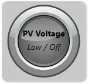{height=107,loading="lazy"}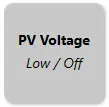{height=107,loading="lazy"}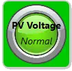{height=107,loading="lazy"} 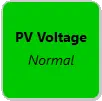{height=107} 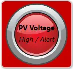{height=107,loading="lazy"}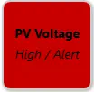{height=107,loading="lazy"}
<!-- Suggested capture: MultiState indicator with Low/Normal/High ranges and state label -->

- Purpose: state display using color/image by value range or boolean mode.
- Binding: required.
- Main properties: `Monitoring Point`, `Boolean Mode`, `Custom Label`, `Show Label`, `Show State Name`, `Show Value`, `Font Size`, `Text Color`, `Show Border`, `Default State Color`.
- Ranges and limits: each range uses inclusive bounds (`Min <= Value <= Max`); if `Max` is set below `Min`, it is normalized up to `Min`; first matching range wins when ranges overlap; default fallback color is RGB(200,200,200) (`#FFC8C8C8`) when no range matches.
- Notes: each state range can carry both `Color` and optional `Image`; when an active range has an image path, the image is shown on top of the background state color.

##### MultiState Configuration Modes

Two modes control how values are interpreted:

1. **Range-Based Mode (Default, `Boolean Mode = false`)**
   - Compares value against a list of ranges
   - Each range: `Min ≤ Value ≤ Max` → shows color and name
   - First match wins; gaps fall back to default color
   - Example: `0-20` = Gray (Low), `21-60` = Green (Normal), `61-100` = Red (High)

2. **Boolean Mode (Legacy Toggle, `Boolean Mode = true`)**
   - Property exists and is persisted for compatibility with older HMI files.
   - In current code path, state selection is still range-driven via `StateRanges` matching.
   - Practical use: configure two ranges (for example `0-0` and `1-1` or `1-100`) to implement on/off behavior.

##### State Ranges Grid (Matches Property Panel)

| Column | Purpose | Code-Backed Behavior |
|---|---|---|
| `MIN` | Lower inclusive bound | Value matches when `CurrentValue >= Min` |
| `MAX` | Upper inclusive bound | Value matches when `CurrentValue <= Max`; if set below `MIN`, it is auto-normalized to `MIN` |
| `NAME` | Display name of active state | Rendered by `CurrentStateName` when `Show State Name = true` |
| `COLOR` | State background color | Applied to widget background as `CurrentStateColor` |
| `IMAGE` | Optional image path per state | When non-empty on active state, shown as overlay (`CurrentStateImagePath`) |

State range actions in the panel (`Add`, `Remove`, `Delete All`, `Copy`, `Paste`, `Copy All`, `Color`, `Clear Color`) operate on these same `StateRanges` rows.

##### MultiState Indicator Recipe Table

| State Pattern | Boolean Mode | Range Count | Default Color | Typical Use Case |
|---|---|---|---|---|
| Simple On/Off | `true` | — | Gray | Device power, switch status |
| Three-state (Low/Normal/High) | `false` | `3` | Gray | Temperature, pressure, level |
| Five-state (health) | `false` | `5` | Gray | System health: Offline/Idle/Running/Warning/Critical |
| Binary fault | `true` | — | Red | Alarm triggered (0=ok, 1=alarm) |
| Load capacity | `false` | `4` | Gray | 0-25% Empty (Blue), 26-75% Normal (Green), 76-99% Full (Yellow), 100% Overflow (Red) |
| Traffic light | `false` | `3` | Gray | Stop (Red) 0-30, Caution (Yellow) 31-60, Go (Green) 61-100 |
| Equipment mode | `false` | `6` | Gray | 1=Init (Gray), 2=Idle (Blue), 3=Run (Green), 4=Pause (Yellow), 5=Error (Red), 6=Unknown (Black) |
| Pump status | `false` | `4` | Gray | 0=Off (Gray), 1-50% Startup (Blue), 51-99% Running (Green), 100% Max (Yellow) |

##### MultiState Indicator Parameter Table

| Property | Purpose | Default | Validated Behavior in Code |
|---|---|---|---|
| `Monitoring Point` | Modbus register to monitor | — | Required; changed register clears indicator state |
| `Boolean Mode` | Legacy mode toggle | `false` | Property is exposed and persisted; current state matching still uses `StateRanges` evaluation |
| `Custom Label` | Optional display label | blank | Falls back to register name if empty |
| `Show Label` | Display label text | `true` | Toggled directly in property editor |
| `Show State Name` | Display current state name | `true` | Toggled directly in property editor |
| `Show Value` | Display numeric value | `false` | Toggled directly in property editor |
| `Default State Color` | Color when out of range | `#FFC8C8C8` | Used when no state range matches or when no register is bound |
| `Font Size` | Size of displayed text | `14` | Numeric input |
| `Text Color` | Color of label/value text | `#FF000000` (black) | Hex color picker |
| `Show Border` | 3D border/shadow | `true` | Toggled directly in property editor |
| `State Ranges` | `Min`/`Max`/`Name`/`Color`/`Image` rows | 3 default rows | Default rows: `Low / Off (0-20)`, `Normal (21-60)`, `High / Alert (61-100)`; first match wins |

##### Recommended MultiState Setup Order

1. Set `Monitoring Point`.
2. Choose `Boolean Mode` or leave it off for range-based.
3. If range-based (default), open the Range Editor and configure Min/Max/Color/Name for each state.
4. Set `Default State Color` for out-of-range fallback.
5. Toggle `Show Label`, `Show State Name`, `Show Value` as desired.
6. Adjust `Font Size` and `Text Color` for visibility.

### Bar Graph

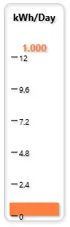 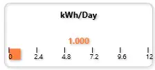
<!-- Suggested capture: Bar Graph with orientation and range-based state color/image -->

- Purpose: fill-level visualization for one bound register.
- Binding: required.
- Main properties: `Monitoring Point`, `Show Label`, `Display Name`, `Background Image`, `Show Value`, `Show Scale`, `Show Border`, `Gauge Minimum`, `Gauge Maximum`, `Bipolar`, `Bipolar Center`, `Value Format`, `Orientation`, `Width`, `Height`.
- Ranges and limits: default range is `Gauge Minimum = 0` and `Gauge Maximum = 100`; `Orientation` supports `North`, `South`, `East`, and `West`; `BipolarCenter` is automatically clamped inside the active range; default size is `200×140` with layout limits `80-800` width and `60-600` height; state ranges can be used to change bar color based on value.
- Notes: use bipolar mode when a center reference matters, such as negative-to-positive deviation around a neutral value. Use state ranges for color-coded alerting.

##### Bar Graph Orientation Rules

- `North`: bar fills from bottom upward when value increases (default)
- `South`: bar fills from top downward
- `East`: bar fills from left to right
- `West`: bar fills from right to left
- `Bipolar`: bar extends from the center (`BipolarCenter`) toward the value; negative deviations fill in the opposite direction

##### Bar Graph Recipe Table

| Gauge Style | Orientation | Bipolar | Bipolar Center | Gauge Min | Gauge Max | State Ranges | Best Use |
|---|---|---|---|---|---|---|---|
| Classic vertical bar | `North` | No | — | `0` | `100` | Optional | Liquid level, tank fill |
| Inverted bar | `South` | No | — | `0` | `100` | Optional | Pressure drop, descent speed |
| Horizontal bar (left-right) | `East` | No | — | `0` | `100` | Optional | Filling or loading progress |
| Horizontal bar (right-left) | `West` | No | — | `0` | `100` | Optional | Consumption or drain rate |
| Bidirectional centered | `North` | Yes | `50` | `0` | `100` | Optional | Deviation from setpoint (±50) |
| Temperature deviation | `North` | Yes | `37` | `32` | `42` | 3+ states | Human temperature (±5 degrees) |
| Pressure deviation | `East` | Yes | `100` | `80` | `120` | 3+ states | Pressure vs nominal (±20 psi) |
| Speed deviation | `North` | Yes | `3000` | `0` | `6000` | 2+ states | RPM vs target (±3000) |

##### Bar Graph Parameter Table

| Property | Purpose | Default | Validated Behavior in Code |
|---|---|---|---|
| `Monitoring Point` | Modbus register to display | — | Required; widget clears data if register changes |
| `Gauge Minimum` | Visual scale minimum | `0` | If max is set lower, max is normalized up |
| `Gauge Maximum` | Visual scale maximum | `100` | Cannot remain below minimum |
| `Orientation` | Fill direction | `North` | Dropdown: North, South, East, West |
| `Bipolar` | Enable center fill mode | `false` | When true, fills from `BipolarCenter` in both directions |
| `Bipolar Center` | Center point for bipolar fill | `0` | Auto-clamped inside active range [min, max] |
| `Value Format` | Number formatting | `F1` | .NET format string; blank uses global decimal places |
| `Show Value` | Display current value | `true` | Toggled directly in property editor |
| `Show Scale` | Show min/max labels | `true` | Toggled directly in property editor |
| `Show Label` | Show widget label | `true` | Toggled directly in property editor |
| `Background Image` | Fallback image when no state matches | blank | Optional; overridden by state image if range matches |
| `Width` | Widget width | `200` | Clamped 80–800 |
| `Height` | Widget height | `140` | Clamped 60–600 |

### Trend

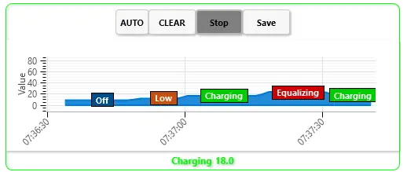 {loading="lazy" }
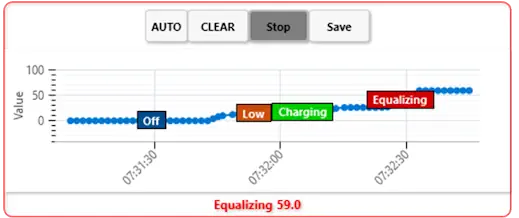 {loading="lazy" }

- Purpose: real-time value history charting.
- Binding: required.
- Main properties: `Monitoring Point`, `Show Label`, `Background Image`, `Show Current Value`, `Show Grid Lines`, `Show Border`, `Show Chart Title`, `Show Control Buttons`, `Chart Minimum`, `Chart Maximum`, `Value Format`, `Max Data Points`, `Sample Interval (sec)`, `Enable Live Update`, `Save to File`, `Render Style`, `Width`, `Height`.
- Ranges and limits: default Y-axis range is `0-100`; `Max Data Points` defaults to `100` and is clamped to a minimum of `10` unless set to `0` for unlimited; `Sample Interval (sec)` defaults to `1.0` and is effectively clamped to `>= 0.1` in code; `Render Style` supports `Line`, `Scatter`, `Area`, and `Step`; default size is `400×250` with editor limits `Width 150-1200` and `Height 100-800`.
- Notes: this is a Pro-tier analytics widget and the largest default widget on the canvas. Use it when users need recent history, not just current state. State ranges can colorize the plot, and `Save to File` exports CSV data into the Documents folder.

##### Trend Render Styles

| Render Style | Visual | Best For |
|---|---|---|
| `Line` | Continuous curve connecting points | Smooth trend visualization, default choice |
| `Scatter` | Discrete point markers | Precise moment-in-time readings, sparse data |
| `Area` | Filled area under the line | Cumulative effect, visual emphasis |
| `Step` | Stair-step transitions between values | Discrete states, counters, or held values |

##### Trend Data Collection Cheat Sheet

| Setting | Practical Meaning | Code-Backed Note |
|---|---|---|
| `Max Data Points = 0` | Unlimited history in memory | Code keeps all samples until cleared |
| `Max Data Points = 100` | Rolling window of 100 samples | Oldest points are removed as new ones arrive |
| `Sample Interval = 1.0` | Roughly 1 sample per second | Default collection interval |
| `Sample Interval < 0.1` | Not allowed in practice | Setter clamps to `0.1` seconds minimum |
| `Enable Live Update = false` | Chart exists but does not collect new samples | Runtime controls or property toggle must enable collection |
| `Save to File = true` | Persist samples to CSV | Writes chart data to Documents folder |

##### Trend Recipe Table

| Trend Scenario | Render Style | Max Data Points | Sample Interval | Show Grid | Min | Max | Purpose |
|---|---|---|---|---|---|---|---|
| Real-time line | `Line` | `100` | `1.0` sec | `true` | `0` | `100` | Default smooth trend |
| Precision readout | `Scatter` | `50` | `1.0` sec | `true` | `0` | `100` | Point-in-time values |
| Filled area (load) | `Area` | `100` | `1.0` sec | `true` | `0` | `100` | Visual fill under curve |
| Discrete machine states | `Step` | `100` | `1.0` sec | `true` | `0` | `5` | State transitions where values hold until the next event |
| Long history | `Line` | `500` | `1.0` sec | `false` | `0` | `100` | Extended time window |
| Dense data | `Scatter` | `200` | `0.5` sec | `false` | `0` | `100` | High-frequency sampling |
| Sparse data | `Line` | `30` | `5.0` sec | `true` | `0` | `100` | Low-frequency updates |
| Temperature trend | `Area` | `100` | `1.0` sec | `true` | `-50` | `50` | Temperature deviation |
| Pressure trend | `Line` | `120` | `1.0` sec | `true` | `80` | `120` | Pressure stability |

##### Trend Parameter Table

| Property | Purpose | Default | Validated Behavior in Code |
|---|---|---|---|
| `Monitoring Point` | Modbus register to trend | — | Required; clearing register clears all trend data |
| `Show Label` | Show widget label above chart | `true` | Toggled directly in property editor |
| `Background Image` | Optional image behind the plot | blank | Image picker; purely visual backdrop |
| `Show Current Value` | Display current register value | `true` | Toggled directly in property editor |
| `Show Grid Lines` | Display major/minor chart grid lines | `true` | Toggled directly in property editor; refreshes plot axes |
| `Show Border` | 3D border/shadow around widget | `true` | Toggled directly in property editor |
| `Show Chart Title` | Show label inside plot area | `false` | Updates the OxyPlot title on change |
| `Show Control Buttons` | Show record/save/control buttons | `true` | Toggled directly in property editor |
| `Chart Minimum` | Y-axis lower bound | `0` | Auto-normalized if set above max |
| `Chart Maximum` | Y-axis upper bound | `100` | Cannot remain below minimum |
| `Value Format` | Display format for current value | `F1` | .NET format string |
| `Max Data Points` | Buffer size (how many points to keep) | `100` | Editor range `0-10000`; `0` = unlimited, otherwise clamped to minimum `10` |
| `Sample Interval (sec)` | Minimum time between samples | `1.0` | Editor allows very small values, but setter clamps to `0.1` sec minimum |
| `Enable Live Update` | Runtime data collection toggle | `false` | When enabled, new samples are collected from the bound register |
| `Save to File` | Export trend data to CSV | `false` | Saves chart data to a CSV file in Documents |
| `Render Style` | Chart type | `Line` | Dropdown: `Line`, `Scatter`, `Area`, `Step` |
| `Width` | Widget width | `400` | Numeric; clamped to `150-1200` |
| `Height` | Widget height | `250` | Numeric; clamped to `100-800` |

##### Recommended Trend Setup Order

1. Set `Monitoring Point`.
2. Set `Chart Minimum` and `Chart Maximum` to bracket expected value range.
3. Choose `Render Style` (`Line` is default; try `Scatter` for point sampling, `Area` for emphasis, `Step` for held values).
4. Set `Max Data Points` and `Sample Interval (sec)` for the history depth and sample rate you need.
5. Toggle `Enable Live Update` and optionally `Save to File` if you want CSV output.
6. Adjust presentation options such as `Show Grid Lines`, `Show Chart Title`, `Show Control Buttons`, `Background Image`, and `Value Format`.

### Line

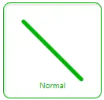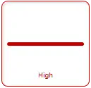
<!-- Suggested capture: Line widget with orientation/angle and state-driven appearance -->

- Purpose: directional/flow line shape with optional data-driven state styling.
- Binding: optional for static decoration, but needed for live state coloring.
- Main properties: `Monitoring Point`, `Use State Coloring`, `Display Name`, `Show Label`, `Show Value`, `Line Color`, `Default State Color`, `Line Image`, `Show Border`, `Line Thickness`, `Orientation`, `Angle (°)`, `Width`, `Height`.
- Ranges and limits: `Line Thickness` is clamped to `1-80`; `Orientation` supports `Horizontal`, `Vertical`, `DiagonalDown`, and `DiagonalUp`; `Angle (°)` is normalized into `0-360`; `Width` and `Height` are clamped to `40-2000`.
- Notes: use this for process flow paths, conveyor direction, piping runs, or connector styling between other widgets. When state coloring is enabled, the line can switch both stroke color and image based on state ranges.

##### Line Orientation Cheat Sheet

| Orientation | Preset Angle | What It Draws |
|---|---:|---|
| `Horizontal` | `0` | Left-to-right horizontal line |
| `Vertical` | `90` | Bottom-to-top vertical line |
| `DiagonalDown` | `45` | Top-left to bottom-right diagonal |
| `DiagonalUp` | `315` | Bottom-left to top-right diagonal |

Changing `Orientation` updates `Angle (°)` to the matching preset. Setting `Angle (°)` manually gives you arbitrary rotation without changing the orientation dropdown label.

##### Line State and Image Rules

| Condition | Effective Color | Effective Image |
|---|---|---|
| No register bound | `Default State Color` | `Line Image` |
| Register bound, `Use State Coloring = false` | `Line Color` | `Line Image` |
| Register bound, state match found | Matching range color | Matching range image, or `Line Image` if the range has no image |
| Register bound, no state match | `Default State Color` | `Line Image` |

State ranges are normalized and sorted by minimum value before evaluation. If a range is entered backwards, the widget swaps the min and max values automatically.

##### Line Recipe Table

| Use Case | Orientation | Angle | Thickness | State Coloring | Image | Notes |
|---|---|---:|---:|---|---|---|
| Static process pipe | `Horizontal` | `0` | `5` | `false` | none | Clean fixed connector between widgets |
| Vertical riser | `Vertical` | `90` | `6` | `false` | none | Good for tank or column feeds |
| Diagonal flow path | `DiagonalDown` | `45` | `5` | `false` | none | Default directional connector |
| Reverse diagonal path | `DiagonalUp` | `315` | `5` | `false` | none | Upward sloping connection |
| Alarm path highlight | `Horizontal` | `0` | `8` | `true` | optional | Uses state ranges to switch color on alarm |
| Conveyor status line | `Horizontal` | `0` | `10` | `true` | optional belt texture | Use image-backed ranges for richer visual states |
| Custom angle arrow shaft | `Horizontal` | `135` | `4` | `false` | none | Arbitrary angle for custom schematic layout |
| Process state overlay | `Vertical` | `90` | `12` | `true` | optional | Thick state-driven line used as status emphasis |

##### Line Parameter Table

| Property | Purpose | Default | Validated Behavior in Code |
|---|---|---|---|
| `Monitoring Point` | Optional Modbus register for live state changes | — | Optional; when omitted, the line uses fallback state styling only |
| `Use State Coloring` | Enable state-range-based color/image changes | `false` | When enabled, the widget evaluates `StateRanges` against the current value |
| `Display Name` | Custom label text | blank | Falls back to register name, then `Line` if empty |
| `Show Label` | Display widget label | `false` | Toggled directly in property editor |
| `Show Value` | Display current numeric value | `false` | Toggled directly in property editor |
| `Line Color` | Base stroke color | `#FF1F5F8A` | Normalized to ARGB hex; used when state coloring is off |
| `Default State Color` | Fallback color when no state matches | `#FF0078D4` | Normalized to ARGB hex; used for no-register and out-of-range fallback |
| `Line Image` | Optional image brush for the line stroke | blank | If present, image brush is used; state image overrides it when a range provides one |
| `Show Border` | Show 3D border shell | inherited default | Toggled directly in property editor |
| `Line Thickness` | Stroke width | `5` | Clamped to minimum `1`; editor range `1-80` |
| `Orientation` | Preset direction helper | `DiagonalDown` | Dropdown: `Horizontal`, `Vertical`, `DiagonalDown`, `DiagonalUp`; changing it also sets the matching preset angle |
| `Angle (°)` | Arbitrary line rotation | `45` | Normalized to `0-360`; negative and over-360 values wrap back into range |
| `Width` | Widget width | `180` | Numeric; editor range `40-2000` |
| `Height` | Widget height | `90` | Numeric; editor range `40-2000` |
| `State Ranges` | Value/color/name/image rules | 3 default rows | Default rows are `Low (0-20)`, `Normal (21-60)`, `High (61-100)`; ranges are normalized and sorted by min |

##### Recommended Line Setup Order

1. Set `Display Name` only if the line needs a visible label.
2. Choose `Orientation` for common directions, or set `Angle (°)` directly for custom geometry.
3. Set `Line Thickness`, `Width`, and `Height` to fit the schematic layout.
4. Set `Line Color` for static usage, or enable `Use State Coloring` for live state response.
5. If using live states, set `Monitoring Point` and define `State Ranges` with color and optional image overrides.
6. Add a `Line Image` only when you want a textured or patterned stroke as the default visual.

### Rounded Rectangle

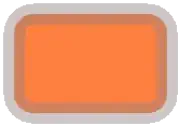 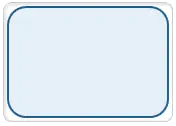 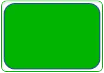
<!-- Suggested capture: Rounded Rectangle used as status panel with corner radius settings -->

- Purpose: rounded status panel, grouping tile, or soft-edged annunciator area.
- Binding: optional for static panels, but required if you want live color or image changes from a monitored value.
- Main properties: `Monitoring Point`, `Use State Coloring`, `Apply State To`, `Display Name`, `Show Label`, `Show Value`, `Use Fill`, `Stroke Color`, `Fill Color`, `Default State Color`, `Fill Image`, `Show Border`, `Radius X`, `Radius Y`, `Stroke Thickness`, `Width`, `Height`, `State Ranges`.
- Defaults and limits: `Radius X = 18`, `Radius Y = 18`, `Stroke Thickness = 2`, `Use Fill = true`, `Apply State To = Fill`; `Radius X` and `Radius Y` allow `0-500`, `Stroke Thickness` allows `0-50`, and `Width`/`Height` allow `40-2000`.
- Notes: when `Use State Coloring` is enabled, the widget either recolors the fill or the outline depending on `Apply State To`. A state-range image overrides the default `Fill Image`; otherwise the default image is used as the fill brush.

##### Rounded Rectangle Cheat Sheet

| Goal | Use these settings | Result |
|---|---|---|
| Plain status tile | `Use Fill = true`, set `Fill Color`, leave `Use State Coloring = false` | Static rounded panel |
| Live alarm tile | Set `Monitoring Point`, turn on `Use State Coloring`, keep `Apply State To = Fill` | Fill changes with the active state range |
| Outline-only panel | `Use Fill = false`, set `Stroke Color`, optionally set `Apply State To = Stroke` | Hollow rounded frame |
| Image-backed tile | `Use Fill = true`, set `Fill Image` | Default image fills the shape |
| State-specific image tile | Add images in `State Ranges` | Matching state image overrides the default fill image |
| Near-ellipse or pill | Increase `Radius X` and `Radius Y` toward half the widget size | Corners become progressively rounder |

##### Rounded Rectangle Build Recipes

| If you want... | Set... | Typical use |
|---|---|---|
| Equipment grouping panel | `Show Border = true`, moderate `Radius X/Y`, muted `Fill Color` | Background group box behind related widgets |
| Machine status tile | `Monitoring Point`, `Use State Coloring`, `Show Label`, `Show Value` | Large OK/Warning/Fault tile |
| Framed image plate | `Fill Image`, `Use Fill = true`, `Stroke Thickness = 1-3` | Decorative panel or equipment faceplate |
| Border alarm frame | `Use Fill = false`, `Apply State To = Stroke`, thicker `Stroke Thickness` | Highlight area without covering content |

##### Rounded Rectangle Parameter Reference

| Property | What it controls | Typical value | Code-backed behavior / limits |
|---|---|---|---|
| `Monitoring Point` | Register used for live state evaluation | Temperature, status, or mode register | Optional; without a bound register the widget uses `Default State Color` and reports `No Register` |
| `Use State Coloring` | Enables state-range driven styling | `On` for alarm/status tiles | When off, the widget stays on its default fill/stroke colors and default image |
| `Apply State To` | Whether the state color affects fill or outline | `Fill` | Only `Fill` or `Stroke` are accepted |
| `Display Name` | Custom label text | `Pump Status` | Falls back to register name or widget type when blank |
| `Show Label` | Shows the label text | `On` | Checkbox |
| `Show Value` | Shows the current numeric value | `On` for live tiles | Checkbox |
| `Use Fill` | Fills the interior | `true` | When off, fill becomes transparent even if a fill image is set |
| `Stroke Color` | Outline color | `#FF1F5F8A` | Normalized to ARGB hex |
| `Fill Color` | Interior color | `#66BFD7EA` | Normalized to ARGB hex |
| `Default State Color` | Fallback live color | `#FF0078D4` | Used when no range matches, no register is bound, or state coloring is off |
| `Fill Image` | Default interior image | Texture or icon panel image | Relative paths are resolved from the current working directory |
| `Show Border` | 3D border shell | `On` for panel look | Checkbox |
| `Radius X` | Horizontal corner radius | `18` | Numeric editor range `0-500`; runtime clamps to `>= 0` |
| `Radius Y` | Vertical corner radius | `18` | Numeric editor range `0-500`; runtime clamps to `>= 0` |
| `Stroke Thickness` | Outline thickness | `2` | Numeric editor range `0-50`; runtime clamps to `>= 0` |
| `Width` | Widget width | `170` | Numeric editor range `40-2000` |
| `Height` | Widget height | `120` | Numeric editor range `40-2000` |
| `State Ranges` | Value/color/name/image rules | 3 default rows | Default rows are `Low (0-20)`, `Normal (21-60)`, `High (61-100)`; min/max are normalized and reversed ranges are swapped |

##### Recommended Rounded Rectangle Setup Order

1. Set `Width`, `Height`, `Radius X`, and `Radius Y` for the basic panel shape.
2. Choose whether the panel should be filled by setting `Use Fill`.
3. Set `Stroke Color`, `Fill Color`, and `Stroke Thickness` for the default appearance.
4. Add `Fill Image` only if you want a textured or illustrated panel surface.
5. If the panel should react live, bind `Monitoring Point`, turn on `Use State Coloring`, and choose `Apply State To`.
6. Define `State Ranges` last so the visual response matches the intended value bands.

### Arrow
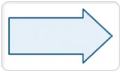{loading="lazy" } 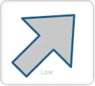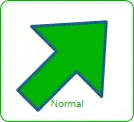{loading="lazy"} 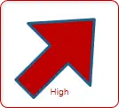{loading="lazy"}
<!-- Suggested capture: Arrow widget showing direction and state-based styling -->

- Purpose: directional process-flow or movement indicator with a tunable head and shaft profile.
- Binding: optional for static flow arrows, but required for live state-based color or image changes.
- Main properties: `Monitoring Point`, `Use State Coloring`, `Apply State To`, `Display Name`, `Show Label`, `Show Value`, `Use Fill`, `Stroke Color`, `Fill Color`, `Default State Color`, `Fill Image`, `Show Border`, `Stroke Thickness`, `Rotation (°)`, `Head Length (%)`, `Shaft Thickness (%)`, `Width`, `Height`, `State Ranges`.
- Defaults and limits: `Head Length (%) = 30`, `Shaft Thickness (%) = 35`, `Width = 170`, `Height = 100`; editor ranges are `Head Length 10-65`, `Shaft Thickness 8-90`, `Stroke Thickness 0-50`, `Rotation 0-360`, `Width/Height 40-2000`.
- Notes: the geometry is drawn pointing right by default, then optionally rotated. State-range images override the default `Fill Image` when a matching range includes an image.

##### Arrow Cheat Sheet

| Goal | Use these settings | Result |
|---|---|---|
| Standard flow arrow | `Head Length = 30`, `Shaft Thickness = 35` | Balanced process arrow |
| Aggressive pointer | Increase `Head Length` toward `50-65` | Larger arrow head, more emphasis on direction |
| Pipe-like arrow | Lower `Head Length`, increase `Shaft Thickness` | Strong shaft, subtler head |
| Thin motion indicator | Lower `Shaft Thickness` toward `8-20` | Lightweight directional cue |
| Point in another direction | Set `Rotation (°)` | Reorients the right-pointing base geometry |
| Live flow state arrow | Bind `Monitoring Point`, enable `Use State Coloring` | Arrow changes color or image by state |

##### Arrow Build Recipes

| If you want... | Set... | Typical use |
|---|---|---|
| Conveyor or pipe flow arrow | Moderate `Stroke Thickness`, `Use Fill = true`, rotate to match route | Process direction on layouts |
| Alarmed direction marker | `Monitoring Point`, `Use State Coloring`, `Apply State To = Fill` | Flow path that changes by state |
| Outline-only navigation marker | `Use Fill = false`, stronger `Stroke Thickness` | Simple schematic direction marker |
| Textured arrow | Set `Fill Image` and keep `Use Fill = true` | Decorative directional indicator |

##### Arrow Parameter Reference

| Property | What it controls | Typical value | Code-backed behavior / limits |
|---|---|---|---|
| `Head Length (%)` | Arrow head depth relative to width | `30` | Numeric editor range `10-65`; runtime clamps to that range |
| `Shaft Thickness (%)` | Shaft thickness relative to height | `35` | Numeric editor range `8-90`; runtime clamps to that range and geometry keeps the half-thickness within `0.04-0.45` of normalized height |
| `Rotation (°)` | Overall arrow direction | `0`, `90`, `180`, `270` | Normalized into `0-360` |
| `Stroke Thickness` | Outline thickness | `2` | Numeric editor range `0-50`; runtime clamps to `>= 0` |
| `Use Fill` | Fills the arrow body | `true` | When off, fill becomes transparent |
| `Apply State To` | Sends state color to fill or outline | `Fill` | Only `Fill` or `Stroke` are accepted |
| `Fill Image` | Default image fill | Flow texture | Overridden by a matching state-range image |
| `Width` | Widget width | `170` | Numeric editor range `40-2000` |
| `Height` | Widget height | `100` | Numeric editor range `40-2000` |
| `State Ranges` | Value/color/name/image rules | 3 default rows | Default rows are `Low (0-20)`, `Normal (21-60)`, `High (61-100)`; ranges are normalized and sorted |

##### Recommended Arrow Setup Order

1. Set `Width` and `Height` for the arrow footprint.
2. Adjust `Head Length (%)` and `Shaft Thickness (%)` to get the right silhouette.
3. Rotate the arrow with `Rotation (°)` so it points where the process actually flows.
4. Set static `Stroke Color`, `Fill Color`, and `Stroke Thickness`.
5. If needed, add `Fill Image` for a textured arrow body.
6. For live behavior, bind `Monitoring Point` and define `State Ranges`.

### Triangle

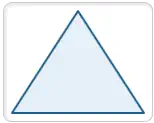{loading="lazy"}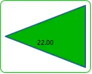{loading="lazy"}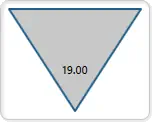{loading="lazy"}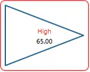{loading="lazy"}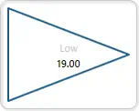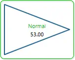{loading="lazy"}
<!-- Suggested capture: Triangle widget in multiple orientations with state color -->

- Purpose: compact pointer or marker for direction, lane indication, or simple state emphasis.
- Binding: optional for static pointers, but required for live state-based color or image changes.
- Main properties: `Monitoring Point`, `Use State Coloring`, `Apply State To`, `Display Name`, `Show Label`, `Show Value`, `Use Fill`, `Stroke Color`, `Fill Color`, `Default State Color`, `Fill Image`, `Show Border`, `Stroke Thickness`, `Rotation (°)`, `Orientation`, `Width`, `Height`, `State Ranges`.
- Defaults and limits: `Orientation = Up`, `Width = 150`, `Height = 120`; `Orientation` supports `Up`, `Down`, `Left`, and `Right`; shared editor ranges are `Stroke Thickness 0-50`, `Rotation 0-360`, `Width/Height 40-2000`.
- Notes: `Orientation` changes the base point layout first, then `Rotation (°)` can further rotate the finished triangle if you need an intermediate angle.

##### Triangle Cheat Sheet

| Goal | Use these settings | Result |
|---|---|---|
| Up indicator | `Orientation = Up` | Triangle points upward |
| Down marker | `Orientation = Down` | Triangle points downward |
| Left or right pointer | `Orientation = Left` or `Right` | Side-pointing marker |
| Exact custom angle | Pick the nearest `Orientation`, then adjust `Rotation (°)` | Fine direction control |
| Solid state marker | `Use Fill = true`, enable `Use State Coloring` | Filled triangle changes by state |
| Outline pointer | `Use Fill = false`, set `Stroke Thickness` | Hollow directional marker |

##### Triangle Build Recipes

| If you want... | Set... | Typical use |
|---|---|---|
| Alarm pointer | `Use State Coloring`, `Apply State To = Fill`, `Show Label = false` | Compact alarm marker near another widget |
| Lane direction symbol | Wide `Width`, modest `Height`, choose `Orientation` | Flow or travel direction marker |
| Equipment pointer | `Show Label = true`, rotate as needed | Points to a device or region |

##### Triangle Parameter Reference

| Property | What it controls | Typical value | Code-backed behavior / limits |
|---|---|---|---|
| `Orientation` | Base triangle direction | `Up` | Only `Up`, `Down`, `Left`, or `Right` are accepted |
| `Rotation (°)` | Additional rotation after base orientation | `0` | Normalized into `0-360` |
| `Use Fill` | Fills the triangle interior | `true` | When off, fill becomes transparent |
| `Stroke Thickness` | Outline thickness | `2` | Numeric editor range `0-50`; runtime clamps to `>= 0` |
| `Fill Image` | Default fill image | Marker texture | Overridden by matching state-range image |
| `Width` | Widget width | `150` | Numeric editor range `40-2000` |
| `Height` | Widget height | `120` | Numeric editor range `40-2000` |
| `State Ranges` | Value/color/name/image rules | 3 default rows | Default rows are `Low (0-20)`, `Normal (21-60)`, `High (61-100)`; ranges are normalized and sorted |

##### Recommended Triangle Setup Order

1. Set `Orientation` for the nearest cardinal direction.
2. Size the marker with `Width` and `Height`.
3. Use `Rotation (°)` only if the built-in orientation choices are not enough.
4. Set fill or outline styling with `Use Fill`, `Stroke Color`, `Fill Color`, and `Stroke Thickness`.
5. If the triangle needs to react live, bind `Monitoring Point` and add `State Ranges`.

### Polygon

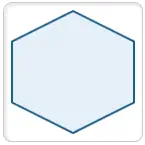{loading="lazy"}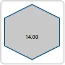{loading="lazy"}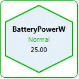{loading="lazy"}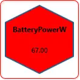{loading="lazy"}
<!-- Suggested capture: Polygon widget with side-count variation and status color -->

- Purpose: regular multi-sided badge, zone marker, or symbolic equipment plate.
- Binding: optional for static geometry, but required for live state-based color or image changes.
- Main properties: `Monitoring Point`, `Use State Coloring`, `Apply State To`, `Display Name`, `Show Label`, `Show Value`, `Use Fill`, `Stroke Color`, `Fill Color`, `Default State Color`, `Fill Image`, `Show Border`, `Stroke Thickness`, `Rotation (°)`, `Side Count`, `Width`, `Height`, `State Ranges`.
- Defaults and limits: `Side Count = 6`, `Width = 140`, `Height = 140`; `Side Count` editor range is `4-8`; shared editor ranges are `Stroke Thickness 0-50`, `Rotation 0-360`, `Width/Height 40-2000`.
- Notes: the polygon is drawn as a regular centered shape. Increasing `Side Count` makes it look more circular, while lower counts make it more angular and emblem-like.

##### Polygon Cheat Sheet

| Goal | Use these settings | Result |
|---|---|---|
| Square-like badge | `Side Count = 4` | Diamond or square-like marker depending on rotation |
| Hex badge | `Side Count = 6` | Balanced industrial symbol |
| Near-round badge | `Side Count = 8` | Softer, almost circular marker |
| Rotate the badge | Adjust `Rotation (°)` | Reorients the polygon without changing side count |
| Live status badge | Bind `Monitoring Point`, enable `Use State Coloring` | Polygon changes by state |

##### Polygon Build Recipes

| If you want... | Set... | Typical use |
|---|---|---|
| Equipment badge | `Side Count = 6`, `Use Fill = true`, `Show Label = true` | Device marker on overview screens |
| Zone marker | Larger `Width`/`Height`, soft fill color | Highlight an area or zone |
| Alarm emblem | `Use State Coloring`, `Apply State To = Fill` | Status seal that shifts color by state |

##### Polygon Parameter Reference

| Property | What it controls | Typical value | Code-backed behavior / limits |
|---|---|---|---|
| `Side Count` | Number of sides in the polygon | `6` | Numeric editor range `4-8`; runtime clamps to that range |
| `Rotation (°)` | Overall polygon rotation | `0` or `45` | Normalized into `0-360` |
| `Use Fill` | Fills the polygon interior | `true` | When off, fill becomes transparent |
| `Stroke Thickness` | Outline thickness | `2` | Numeric editor range `0-50`; runtime clamps to `>= 0` |
| `Fill Image` | Default fill image | Badge texture | Overridden by matching state-range image |
| `Width` | Widget width | `140` | Numeric editor range `40-2000` |
| `Height` | Widget height | `140` | Numeric editor range `40-2000` |
| `State Ranges` | Value/color/name/image rules | 3 default rows | Default rows are `Low (0-20)`, `Normal (21-60)`, `High (61-100)`; ranges are normalized and sorted |

##### Recommended Polygon Setup Order

1. Choose `Side Count` for the overall visual character.
2. Set `Width` and `Height`.
3. Rotate the shape only if you need a different badge orientation.
4. Set fill, stroke, and border styling.
5. Bind `Monitoring Point` and define `State Ranges` if the polygon should act as a live status badge.

### Arc  
{loading="lazy"}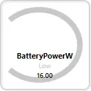{loading="lazy"}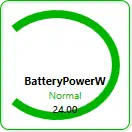{loading="lazy"}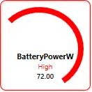{loading="lazy"}
<!-- Suggested capture: Arc widget with start/sweep angle and stroke thickness -->

- Purpose: open arc or filled sector for radial emphasis, partial rings, and highlight wedges.
- Binding: optional for static overlays, but required for live state-based color or image changes.
- Main properties: `Monitoring Point`, `Use State Coloring`, `Apply State To`, `Display Name`, `Show Label`, `Show Value`, `Use Fill`, `Stroke Color`, `Fill Color`, `Default State Color`, `Fill Image`, `Show Border`, `Stroke Thickness`, `Rotation (°)`, `Start Angle (°)`, `Sweep Angle (°)`, `Render As Sector`, `Width`, `Height`, `State Ranges`.
- Defaults and limits: `Start Angle = 225`, `Sweep Angle = 270`, `Render As Sector = false`, `Stroke Thickness = 8`, `Use Fill = false`, `Width = 170`, `Height = 120`; editor ranges are `Start Angle 0-360`, `Sweep Angle -359 to 359`, `Stroke Thickness 0-50`, `Rotation 0-360`, `Width/Height 40-2000`.
- Notes: positive sweep values draw clockwise and negative values draw counterclockwise. If the entered sweep is too close to zero, runtime forces it to `1` or `-1` so the geometry remains visible.

##### Arc Cheat Sheet

| Goal | Use these settings | Result |
|---|---|---|
| Open radial accent | `Render As Sector = false`, `Use Fill = false` | Outline arc only |
| Filled wedge | `Render As Sector = true`, `Use Fill = true` | Solid sector from center to arc |
| Clockwise sweep | Positive `Sweep Angle (°)` | Arc moves clockwise from `Start Angle` |
| Counterclockwise sweep | Negative `Sweep Angle (°)` | Arc moves the opposite direction |
| Thick partial ring | Increase `Stroke Thickness` | Heavier open arc |
| State-highlight wedge | Bind `Monitoring Point`, enable `Use State Coloring` | Sector or arc changes by state |

##### Arc Build Recipes

| If you want... | Set... | Typical use |
|---|---|---|
| Partial ring highlight | `Render As Sector = false`, `Use Fill = false`, higher `Stroke Thickness` | Emphasis around another radial widget |
| Pie-slice alarm zone | `Render As Sector = true`, `Use Fill = true` | Highlight a radial region |
| Directional radial cue | Adjust `Start Angle`, sign of `Sweep Angle`, and `Rotation (°)` | Radial process or zone indication |

##### Arc Parameter Reference

| Property | What it controls | Typical value | Code-backed behavior / limits |
|---|---|---|---|
| `Start Angle (°)` | Where the arc begins | `225` | Normalized into `0-360` |
| `Sweep Angle (°)` | How far the arc travels | `270` | Numeric editor range `-359 to 359`; runtime clamps to that range and forces values with magnitude below `1` to `1` or `-1` |
| `Render As Sector` | Open arc vs center-filled wedge | `false` | Checkbox |
| `Use Fill` | Whether the shape interior is filled | `false` by default | Particularly important when `Render As Sector = true`; an open arc can still leave fill transparent |
| `Stroke Thickness` | Arc outline thickness | `8` | Numeric editor range `0-50`; runtime clamps to `>= 0`; geometry also adjusts radius inward based on thickness |
| `Rotation (°)` | Extra overall rotation | `0` | Normalized into `0-360` |
| `Fill Image` | Default fill image | Sector texture | Overridden by matching state-range image |
| `Width` | Widget width | `170` | Numeric editor range `40-2000` |
| `Height` | Widget height | `120` | Numeric editor range `40-2000` |
| `State Ranges` | Value/color/name/image rules | 3 default rows | Default rows are `Low (0-20)`, `Normal (21-60)`, `High (61-100)`; ranges are normalized and sorted |

##### Recommended Arc Setup Order

1. Decide whether you need an open arc or a filled wedge by setting `Render As Sector`.
2. Set `Start Angle (°)` and `Sweep Angle (°)` for the actual radial span.
3. Set `Width`, `Height`, and `Stroke Thickness`.
4. Use `Rotation (°)` only if the direct angle settings are not enough for placement.
5. Choose static fill/stroke colors or bind `Monitoring Point` for live state behavior.
6. Add `State Ranges` last if the arc should change by value band.

### Choosing the Right Widget

- Use `Numeric` for exact values.
- Use `Dial180` or `Bar Graph` for quick visual status.
- Use `MultiState Indicator` for clear state color changes.
- Use `Trend` for value history.
- Use `Button` and `Slider` for write actions.
- Use shape widgets for grouping, flow direction, and layout.

### Why Teams Choose XPF HMI (ROI)

`Modbus Monitor XPF HMI` helps teams deliver dashboards faster and operate with greater confidence.

- Faster commissioning: build live Modbus HMI dashboards without custom UI development
- Reduced downtime: state-aware widgets and trends expose issues earlier
- Lower engineering effort: reusable `.hmi` layouts reduce repetitive setup
- Better operator clarity: purpose-built industrial widgets improve usability
- Scalable deployment: one workflow for commissioning, operations, and maintenance

This combination makes XPF a practical alternative to heavier HMI/SCADA solutions for many real-world applications.

Common search terms this guide supports:

- `Modbus HMI dashboard`
- `industrial HMI software`
- `SCADA-style Modbus monitoring`
- `real-time Modbus trend chart`
- `operator dashboard for PLC/Modbus`

### Next Steps

- Previous: [XPF Quick Start Guide](quick-start.md)
- Next: [XPF User Guide](user-guide.md)
- Related: [HMI Widget Management](hmi-widget-management.md)

### Ready to Try?

Open Modbus Monitor XPF and build your first dashboard in minutes.
