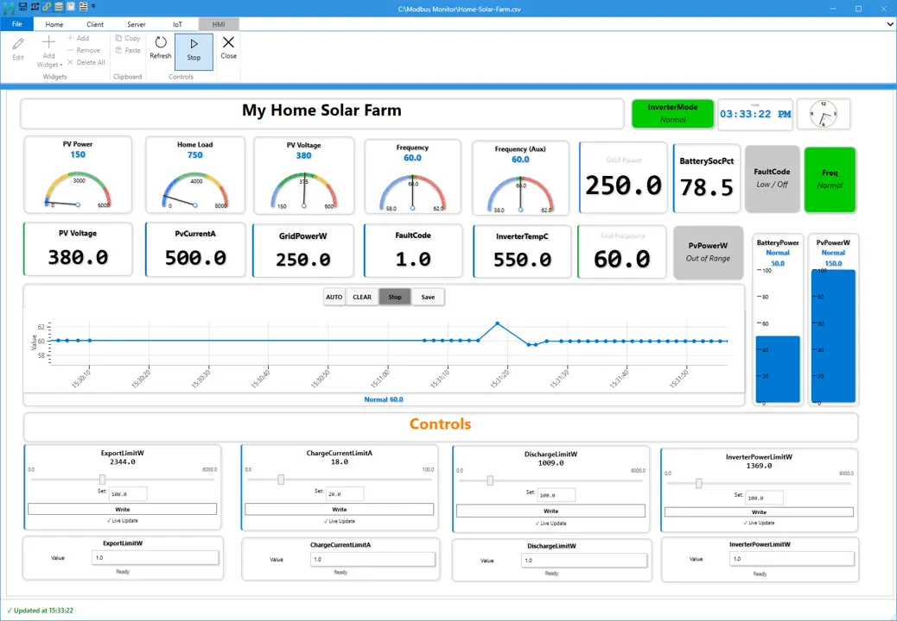

# Modbus Monitor XPF HMI Guide

Use this as the single HMI guide page for XPF. It covers overview, dashboard management workflow, and widget reference in one place.

{ .screenshot-shadow loading="lazy" }
*Example HMI dashboard layout in XPF*

## About HMI

The HMI feature in Modbus Monitor XPF lets you build live dashboards using widgets connected to Modbus data. You can create monitoring screens, status panels, trend views, and operator controls without building a custom interface from scratch.

Use the HMI feature when you need:
- a live dashboard for commissioning
- a simple operator screen
- a reusable monitoring layout
- a quick way to test values, states, and controls together

<!-- Screenshot placeholder: xpf-hmi-guide-01-overview.png -->
> Image coming soon...
<!-- Suggested capture: HMI page open with one complete sample dashboard -->

## What You Can Build

Common uses include:
- real-time monitoring screens
- equipment status panels
- operator control panels
- setpoint adjustment screens
- trend views for changing values
- dashboards with time and event visibility

## Available Widget Categories

### Core Gauges and Status Widgets

Use these widgets to display live values and state changes:
- `Numeric`
- `Dial180`
- `Bar Graph`
- `MultiState Indicator`

### Interactive Controls

Use these widgets when operators need to write or adjust values:
- `Button`
- `Slider`
- `Text Label` for labels, messages, or optional text write scenarios

### Advanced and Utility Widgets

Use these widgets for trends, time display, layout, and visual grouping:
- `Trend`
- `Clock`
- `Line`
- `Rounded Rectangle`
- `Arrow`
- `Triangle`
- `Polygon`
- `Arc`

Jump to [Widget Reference](#widget-reference).

<!-- Screenshot placeholder: xpf-hmi-guide-02-widget-categories.png -->
> Image coming soon...
<!-- Suggested capture: one dashboard showing numeric, state, trend, button, and shape widgets together -->

## Basic Dashboard Workflow

### 1. Open the HMI area

Open the **HMI** tab in XPF.

### 2. Add widgets

Choose the widget types needed for your dashboard.

### 3. Bind data

Connect each widget to the correct Modbus monitor point.

### 4. Configure properties

Set ranges, labels, colors, formatting, limits, and behavior.

### 5. Save the dashboard

Save the dashboard so it can be reopened, copied, or shared.

### 6. Run and monitor

Use the live dashboard for monitoring, troubleshooting, and operator interaction.

Jump to [HMI Dashboard Management](#hmi-dashboard-management).

## Save and Load Behavior

Supported file formats:

- `.hmi` for dashboard packages with image assets

When loading dashboards:
- You can drag and drop a `.hmi` file directly onto the HMI background or canvas.
- If a `.hmi` file and a `.csv` file are in the same folder and share the same base name, XPF automatically finds and loads both.
- Example: `line-a.hmi` and `line-a.csv`.

This makes it easier to reopen complete dashboard and register-map pairs.

<!-- Screenshot placeholder: xpf-hmi-guide-03-save-load.png -->
> Image coming soon...
<!-- Suggested capture: dragging a .hmi file onto the canvas and loaded dashboard result -->

## Recommended First Dashboard

A simple first dashboard usually includes:

- one `Numeric` widget
- one `Dial180` or `Bar Graph`
- one `MultiState Indicator`
- one `Trend`
- one `Button` or `Slider`
- one `Clock`

This gives a balanced screen with value display, state visibility, trend history, and operator control.

## Licensing Notes

Some widgets and dashboard capabilities depend on the active HMI license tier. Core display widgets are available in lower tiers, while controls and trending may require higher tiers.

The widget gallery shows only the widgets available for the current license tier.

## HMI Dashboard Management { #hmi-dashboard-management }

Use this section to create, edit, and run HMI dashboards in XPF.

### Ribbon Controls

| Group | Control | What It Does |
|---|---|---|
| Widgets | Edit | Turns design mode on or off |
| Widgets | Add Widget | Opens the full widget gallery |
| Widgets | Add | Adds a default widget |
| Widgets | Remove | Deletes selected widget |
| Widgets | Delete All | Clears all widgets from canvas |
| Clipboard | Copy | Copies selected widget (`Ctrl+C`) |
| Clipboard | Paste | Pastes a duplicate (`Ctrl+V`) |
| Controls | Refresh | Reloads current values |
| Controls | Start/Stop | Starts or stops monitoring engine |

### Add, Configure, and Validate Widgets

1. Turn **Edit** on.
2. Click **Add Widget** and pick a widget type.
3. Set **Monitoring Point**.
4. Configure range and display properties.
5. Add state ranges for widgets that support state logic.
6. Turn **Edit** off and validate runtime behavior.

### Copy and Paste

- Copy keeps widget properties, style, binding, and state ranges.
- Paste creates a new widget with a new ID and position offset.

### Save and Load

See [Save and Load Behavior](#save-and-load-behavior) above for file types and auto-pair behavior.

### Shape Tip: Ellipse from Rounded Rectangle

- Set `RadiusX = Width / 2`
- Set `RadiusY = Height / 2`

Example circle:
- `Width=120`, `Height=120`, `RadiusX=60`, `RadiusY=60`

## Widget Reference { #widget-reference }

Use this section for widget setup, key properties, and min/max ranges.

### Widget List

| # | Widget | Register Binding | Write Support | Best Use |
|---|---|---|---|---|
| 1 | Numeric | Required | No | Clear process value display |
| 2 | Button | Required | Yes | One-click command/write |
| 3 | Dial180 | Required | No | Analog-style gauge view |
| 4 | Text Label | Optional | Optional | Titles, notes, text values |
| 5 | Clock | Not required | No | Time on dashboard |
| 6 | Slider | Required | Yes | Setpoint adjustment |
| 7 | MultiState Indicator | Required | No | State by value range |
| 8 | Bar Graph | Required | No | Fill-level visualization |
| 9 | Trend | Required | No | Real-time history trend |
| 10 | Line | Optional | No | Direction/flow line |
| 11 | Rounded Rectangle | Optional | No | Status tile / shape zone |
| 12 | Arrow | Optional | No | Direction indicator |
| 13 | Triangle | Optional | No | Compact directional marker |
| 14 | Polygon | Optional | No | Multi-sided status marker |
| 15 | Arc | Optional | No | Arc/sector indicator |

### Quick Setup Rules

1. Bind **Monitoring Point** first.
2. Set **Minimum/Maximum** when the widget has a range.
3. Set labels and formatting.
4. Add state ranges where supported.
5. Turn **Edit** off and validate runtime behavior.

### Key Widget Property Summary

| Widget | Core Properties |
|---|---|
| Numeric | `Monitoring Point`, `DisplayFormat`, `MinValue`, `MaxValue` |
| Button | `Monitoring Point`, `WriteValue`, `MinValue`, `MaxValue` |
| Dial180 | `Monitoring Point`, `Minimum`, `Maximum`, `StartAngle`, `SweepAngle` |
| Text Label | `DisplayText`, optional binding |
| Clock | `TimeFormat`, `DisplayMode`, `ShowSeconds` |
| Slider | `Monitoring Point`, `MinValue`, `MaxValue`, `SliderStep` |
| MultiState Indicator | `Monitoring Point`, `StateRanges` |
| Bar Graph | `Minimum`, `Maximum`, `Orientation`, `BipolarCenter` |
| Trend | `Minimum`, `Maximum`, `SampleCount`, `RenderStyle` |
| Line | `LineThickness`, `Orientation`, `AngleDegrees` |
| Rounded Rectangle | `RadiusX`, `RadiusY`, `StrokeThickness`, `RotationDegrees` |
| Arrow | `HeadLengthPercent`, `ShaftThicknessPercent`, `RotationDegrees` |
| Triangle | `Orientation`, `StrokeThickness`, `RotationDegrees` |
| Polygon | `SideCount`, `StrokeThickness`, `RotationDegrees` |
| Arc | `StartAngle`, `SweepAngle`, `StrokeThickness`, `RotationDegrees` |

### Choosing the Right Widget

- Use `Numeric` for exact values.
- Use `Dial180` or `Bar Graph` for quick visual status.
- Use `MultiState Indicator` for clear state color changes.
- Use `Trend` for value history.
- Use `Button` and `Slider` for write actions.
- Use shape widgets for grouping, flow direction, and layout.

## See Also

- [User Guide](user-guide.md)
- [Quick Start Guide](quick-start.md)
