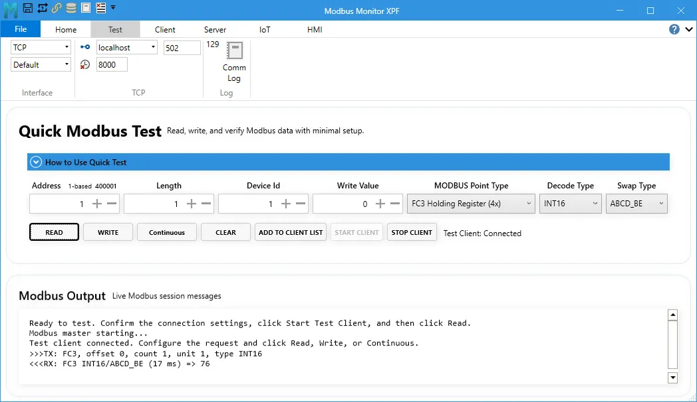
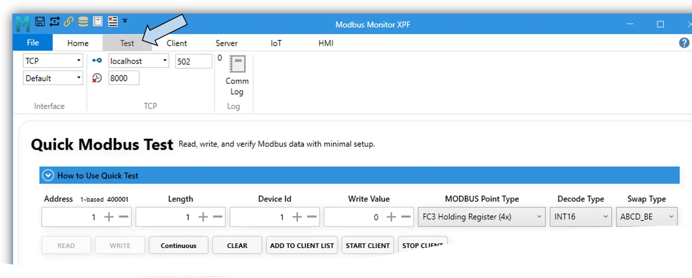
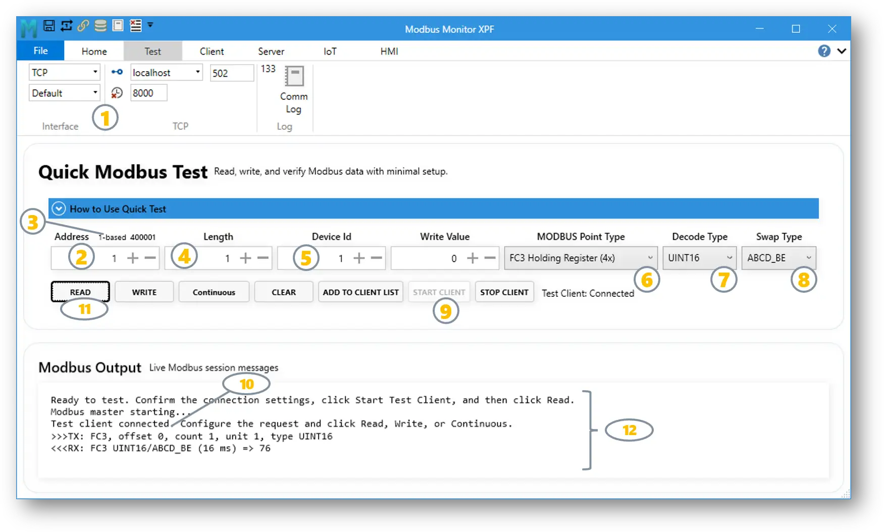
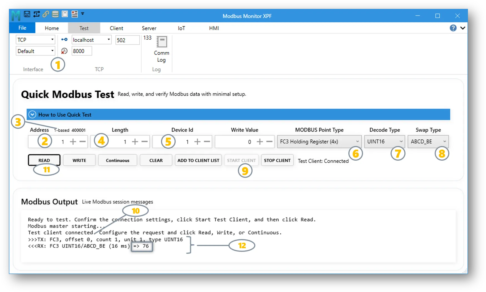
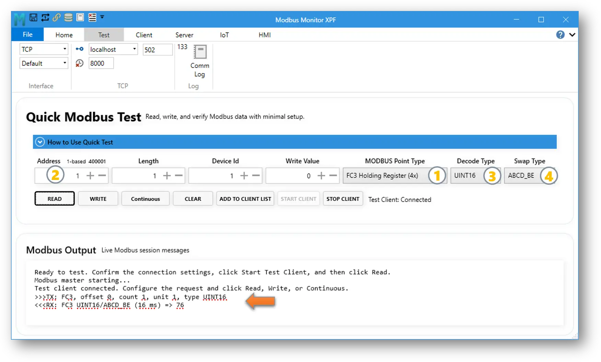
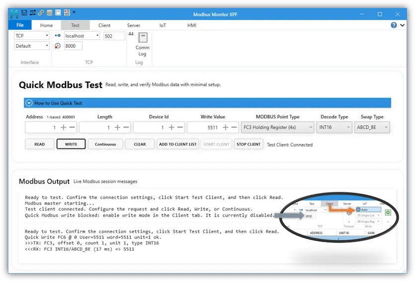
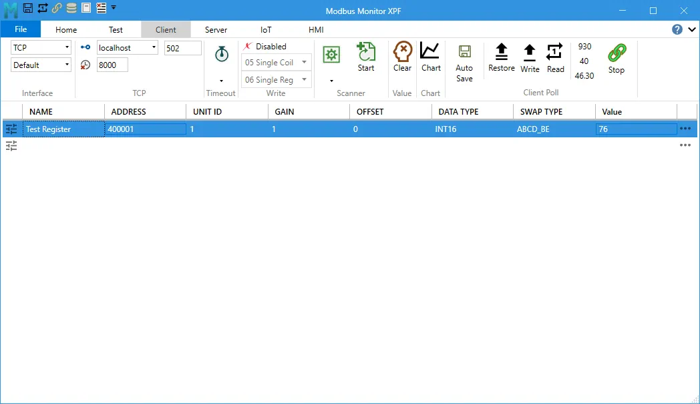

Title: Quick Modbus Test Guide | Read, Write, and Verify Modbus Registers
Description: Learn how to use Quick Modbus Test in Modbus Monitor XPF to connect to a Modbus TCP or serial device, read or write a register, decode values, troubleshoot addressing, and add verified points to monitoring.

# Quick Modbus Test

**Test and verify Modbus communication before building a monitoring project**

Quick Modbus Test is a focused workspace in **Modbus Monitor XPF** for reading, writing, and continuously polling a Modbus point with minimal setup. It helps you confirm that the connection, function code, address, device ID, data type, and byte order are correct before you add the point to the full Client monitor list.

This is especially useful when you are:

- Connecting to a new PLC, drive, meter, inverter, sensor, or controller
- Checking whether a device responds
- Validating an address from a register map
- Finding the correct data type or byte order
- Testing a value before long-term monitoring
- Troubleshooting an unexpected or incorrect value

The recommended workflow is:

**Connect → Test → Verify → Add to Client List → Monitor → Trend → Build HMI**

<!-- SAMPLE SCREENSHOT: Full Quick Modbus Test workspace -->
<!-- Suggested file: ../../assets/screenshots/xpf/quick-modbus-test-overview.png -->
<!-- Capture the complete workspace after a successful read. Include the request fields, buttons, connected status, and Modbus Output. -->
{ .screenshot-shadow loading="lazy" }
## Before You Begin

You need the communication settings and register information from the device manual.

For a Modbus TCP device, identify:

- IP address or host name
- TCP port, normally `502`
- Device ID (also called Unit ID, Slave ID, or Station ID)
- Register type and address

For a Modbus RTU or ASCII device, identify:

- COM port
- Baud rate
- Data bits
- Parity
- Stop bits
- Device ID
- Register type and address

!!! warning "Use Writes Carefully"
    Writing the wrong value can start equipment, change a setpoint, or alter device configuration. Confirm the address and permitted range in the manufacturer's documentation. During initial testing, use **Read** first. Enable writing only when the device and process are in a safe state.

## Open Quick Modbus Test

1. Start Modbus Monitor XPF.
2. Configure the target connection in the **Client** ribbon:
   - For Ethernet, select the correct protocol and enter the device IP address and port.
   - For serial communication, select the COM port and match the device's serial settings.
3. Open the **Modbus Test** tab or workspace.
4. Expand **How to Use Quick Test** if you want to see the built-in reminder.

<!-- SAMPLE SCREENSHOT: Where to open Modbus Test -->
<!-- Suggested file: ../../assets/screenshots/xpf/open-modbus-test-tab.png -->
<!-- Highlight the Modbus Test navigation item and the Client connection settings used by Quick Test. -->
{.screenshot-shadow loading="lazy"}

## Understand the Request Fields

| Field | What It Means | Beginner Example |
|------|----------------|------------------|
| **Address** | Starting coil or register to test | `0`, `1`, or `400001`, depending on addressing mode |
| **Length** | Number of coils or registers requested | Start with `1` |
| **Device Id** | Address of the Modbus server device | Often `1` |
| **Write Value** | Value sent when you click **Write** | Leave unchanged while testing reads |
| **MODBUS Point Type** | Selects the Modbus data area and function | Holding Register (FC03) |
| **Decode Type** | Converts raw register words into a useful value | `UINT16`, `INT16`, or `FLOAT32` |
| **Swap Type** | Controls byte and word order | Start with `ABCD_BE` |

### Point Types

| Point Type | Function | Typical Use | Read/Write |
|------------|----------|-------------|------------|
| **Coils** | FC01 | On/off commands and outputs | Read and write |
| **Discrete Inputs** | FC02 | On/off status inputs | Read only |
| **Holding Registers** | FC03 | Setpoints, counters, and general values | Read and write |
| **Input Registers** | FC04 | Measurements and read-only values | Read only |

!!! note "Function Code vs. Data Type"
    The **Point Type** selects where the data is stored and which Modbus function is used. The **Decode Type** controls how returned register words are interpreted. For example, a Holding Register can contain a `UINT16`, `INT16`, `FLOAT32`, or another supported value type.

## Addressing Without Guesswork

Modbus manuals commonly describe the same physical location in different ways. Quick Modbus Test supports raw offsets and familiar reference-address notation.

| Data Area | Function | Common Reference Example | First Zero-Based Offset |
|-----------|----------|--------------------------|-------------------------|
| Coils | FC01 | `000001` | `0` |
| Discrete Inputs | FC02 | `100001` | `0` |
| Input Registers | FC04 | `300001` | `0` |
| Holding Registers | FC03 | `400001` | `0` |

Use the addressing control beside **Address** to switch between zero-based and one-based entry.

For example, a manual may call the first holding register:

- `400001` in six-digit reference notation
- `1` in one-based offset notation
- `0` in zero-based protocol notation

These can identify the same physical register. Always check whether the manufacturer's register map starts at 0 or 1.

<!-- SAMPLE SCREENSHOT: Addressing control -->
<!-- Suggested file: ../../assets/screenshots/xpf/quick-test-addressing.png -->
<!-- Highlight Address, the zero-based/one-based toggle, the six-digit display, and Point Type. -->

!!! tip "A Simple Address Test"
    If the device responds with **Illegal Data Address**, verify the Point Type first. Then check whether the manual's address needs a one-position offset. Avoid changing several settings at once; one controlled change makes troubleshooting easier.

## Read Your First Register

Use a known, read-only value for the first test, such as device temperature, voltage, status, or firmware version.

1. Configure the connection in the **InterFace** section.
2. In Quick Modbus Test, enter the **Address**.  
3. Set `1-based` or `0-based` to toggle address mode. Click the label to change the mode.
4. Set **Length** to `1`.
5. Enter the correct **Device Id**.
6. Select the matching **MODBUS Point Type**.
7. Start with **UINT16** for a single unsigned register unless the device manual specifies another type.
8. Start with **ABCD_BE** for **Swap Type**.
9. Click **Start Client**.
10. Confirm the status reads **Test Client: Connected**.
11. Click **Read**.
12. Review the result in **Modbus Output**.

<!-- SAMPLE SCREENSHOT: Successful single-register read -->
<!-- Suggested file: ../../assets/screenshots/xpf/quick-test-successful-read.png -->
<!-- Show the completed fields, Connected status, Read button, TX line, RX line, decoded value, and elapsed time. -->
{.screenshot-shadow loading="lazy"}

### Reading Multi-Register Values

Some values use more than one 16-bit register:

| Decode Type | Registers Normally Required |
|-------------|-----------------------------|
| `INT16` or `UINT16` | 1 |
| `INT32`, `UINT32`, or `FLOAT32` | 2 |
| `INT64`, `UINT64`, or `DOUBLE64` | 4 |

When a selected decode type needs more registers, Quick Modbus Test automatically increases the effective read length and reports the adjustment in Modbus Output.

## Interpret Modbus Output

The output area records the request and response so you can see what happened.

- `>>>TX` describes the transmitted request.
- `<<<RX` describes the received response and decoded result.
- **Elapsed time** shows how long the request took.
- An **exception** or error message explains why the request failed.

Use **Clear** to empty the output before a new troubleshooting test.

<!-- SAMPLE SCREENSHOT: Modbus Output explained -->
<!-- Suggested file: ../../assets/screenshots/xpf/quick-test-output-annotated.png -->
<!-- Annotate one TX request, one successful RX response, decoded data, and response time. -->

## Correct a Value That Looks Wrong

A successful response does not always mean the displayed number is interpreted correctly. If the value looks unrealistic:

1. Confirm the **Point Type** and **Address**.
2. Check the device manual for the specified data format.
3. Select the matching **Decode Type**.
4. For 32-bit or 64-bit values, try the documented **Swap Type**.
5. Read again after each change.

Common symptoms:

| Symptom | Likely Cause |
|---------|--------------|
| Large positive value instead of a negative value | `UINT16` selected instead of `INT16` |
| Tiny, huge, or unstable decimal | Wrong `FLOAT32` word or byte order |
| Correct response but wrong register | Zero-based vs. one-based address mismatch |
| No response | Connection settings, cable, IP address, port, COM settings, or Device ID |

## Poll Continuously

After one successful read, use **Continuous** to watch the point update repeatedly.

1. Keep the Test Client connected.
2. Turn on **Continuous**.
3. Watch new responses appear in Modbus Output.
4. Turn off **Continuous** when the test is complete.

Continuous polling uses the configured scan rate, with a minimum interval of 100 milliseconds.

!!! tip "When to Use Continuous"
    Use continuous polling to observe a changing sensor, confirm stable communications, or compare a device display with the decoded Modbus value. For long-term monitoring, add the point to the Client list instead.

## Write a Coil or Register

Quick Modbus Test can write coils and holding registers. Writing must first be enabled in the **Client** tab; if write mode is disabled, Quick Test blocks the operation.

1. Confirm the device documentation permits writing to the address.
2. Enable the appropriate write mode in the **Client** tab.
3. Select **Coils** or **Holding Registers** as the Point Type.
4. Enter the **Address**, **Device Id**, and **Write Value**.
5. For registers, select the correct **Decode Type** and **Swap Type**.
6. Click **Write**.
7. Review the confirmation in Modbus Output.
8. Click **Read** to verify the device accepted the new value.

For a coil, `0` means off and any nonzero write value means on. Depending on Client write settings, XPF uses the appropriate single or multiple write function.

<!-- SAMPLE SCREENSHOT: Safe write workflow -->
<!-- Suggested file: ../../assets/screenshots/xpf/quick-test-write.png -->
<!-- Highlight Client write-mode setting, Write Value, Point Type, Write button, and successful output. -->

## Add a Verified Point to the Client List

After the result is correct, click **Add to Client List**. XPF creates a new Client monitor point using the current:

- Address and addressing mode
- Device ID
- Point Type
- Decode Type
- Swap Type

The new point appears as **Test Register** in the Client monitor list. Rename it to a meaningful device tag, then use the normal Client workflow for continuous monitoring, charting, logging, limits, or HMI widgets.

<!-- SAMPLE SCREENSHOT: Add to Client List -->
<!-- Suggested file: ../../assets/screenshots/xpf/quick-test-add-to-client.png -->
<!-- Use a before-and-after image showing the verified Quick Test settings and the new Test Register row in the Client list. -->

For the complete monitoring workflow, see [Modbus Client Operations](user-guide.md#modbus-client-operations) and [Monitor Points Configuration](user-guide.md#monitor-points-configuration).

## Troubleshooting

| Message or Symptom | What to Check |
|--------------------|---------------|
| **Modbus master is not running** | Click **Start Client** and confirm the connection status |
| **Connection timeout** | Verify IP address, port, network path, firewall, or serial settings |
| **Illegal Function** | The device may not support the selected Point Type or function |
| **Illegal Data Address** | Check the register type, address, and zero-based/one-based mode |
| **Illegal Data Value** | Check Length, write value, and the device's allowed range |
| **Wrong decoded value** | Verify Decode Type, Length, and Swap Type |
| **Write blocked** | Enable write mode in the Client tab |
| **Continuous stops** | Check whether the Test Client disconnected or a communication error occurred |

### Beginner Troubleshooting Order

Change one item at a time:

1. Confirm the device is powered and reachable.
2. Confirm IP/port or COM settings.
3. Confirm Device ID.
4. Confirm Point Type.
5. Confirm Address and addressing mode.
6. Confirm Decode Type.
7. Confirm Swap Type.

This order separates communication problems from data-format problems and prevents random setting changes.

## Quick Test Checklist

- [ ] The connection settings match the device.
- [ ] The Test Client shows **Connected**.
- [ ] Device ID matches the device.
- [ ] Point Type matches the register map.
- [ ] Addressing mode matches the register map.
- [ ] Read succeeds before writing is attempted.
- [ ] Decode Type and Swap Type produce a realistic value.
- [ ] The verified point has been added to the Client list if ongoing monitoring is needed.

## Related Guides

- [Modbus Monitor XPF Quick Start](quick-start.md)
- [Complete XPF User Guide](user-guide.md)
- [Modbus Client Operations](user-guide.md#modbus-client-operations)
- [Monitor Points Configuration](user-guide.md#monitor-points-configuration)
- [HMI Dashboard Guide](hmi.md)
- [Modbus Device Maps](device-maps/index.md)
